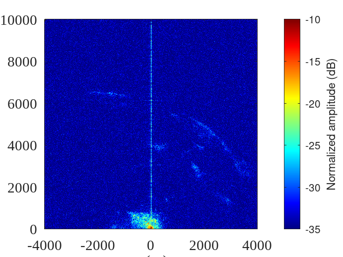
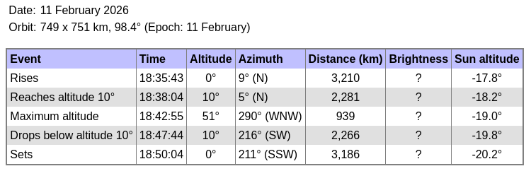

## Missing reference signal.

The reference antenna was mistakenly connected to the wrong input of the B210, making the
signal unusable. To try and save the measurement, the autocorrelation was used on the
surveillance channel, since the strong reference chirp is leaking into the surveillance channel
despite the ground plane of the reference antenna.

Using surveillance signal as reference requires removing DSI (Direct Signal Interference)
cancellation whose purpose is exactly to remove the reference from the short range surveillance.

Settings:
* surveillance on A with 55+20 dB gain
* reference on B with 55 dB gain

Heavens Above prediction:

