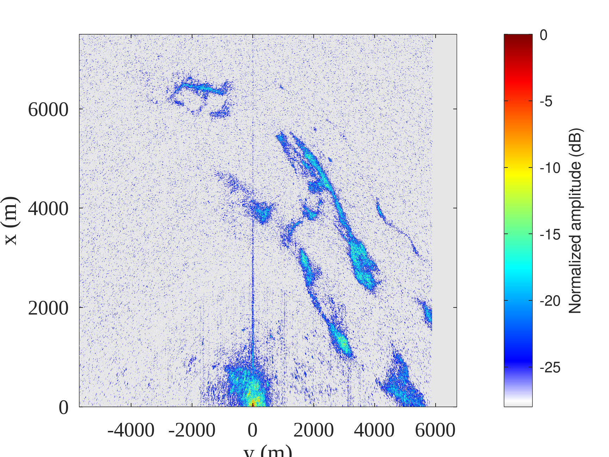

1. ``b210process.m`` to identify the time when the beam illuminated the receivers
2. ``go_b210.m`` to identify the transmitted chirps time (save ``kpos`` in ``kpos.mat``)
3. ``nisarbmaxb210_process5.m`` for range-azimuth processing

