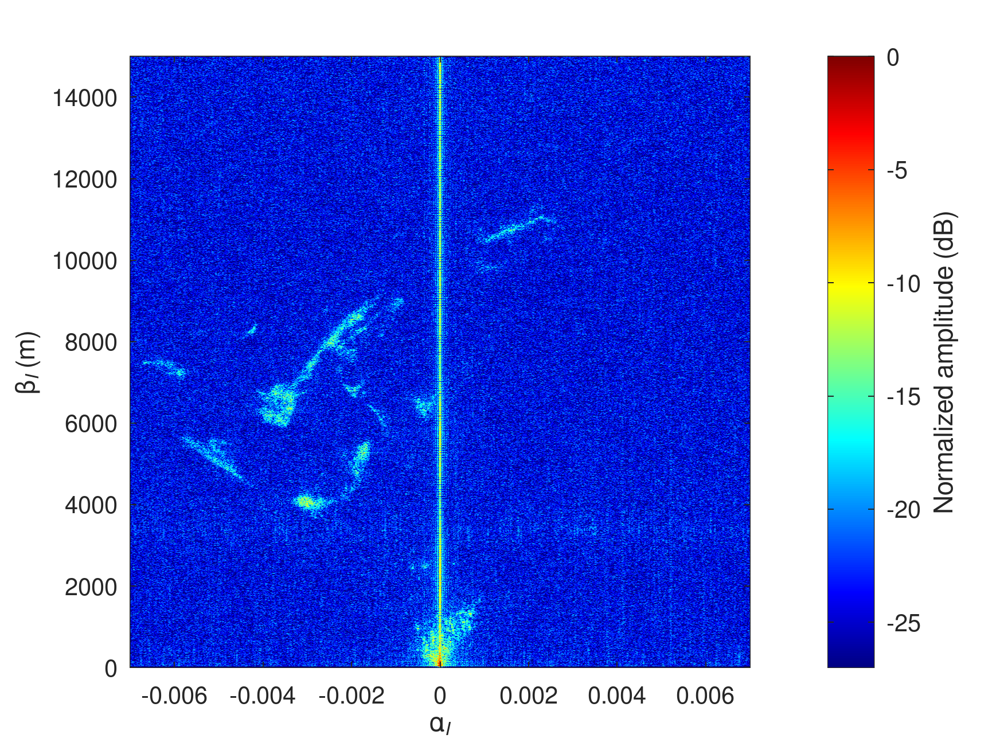
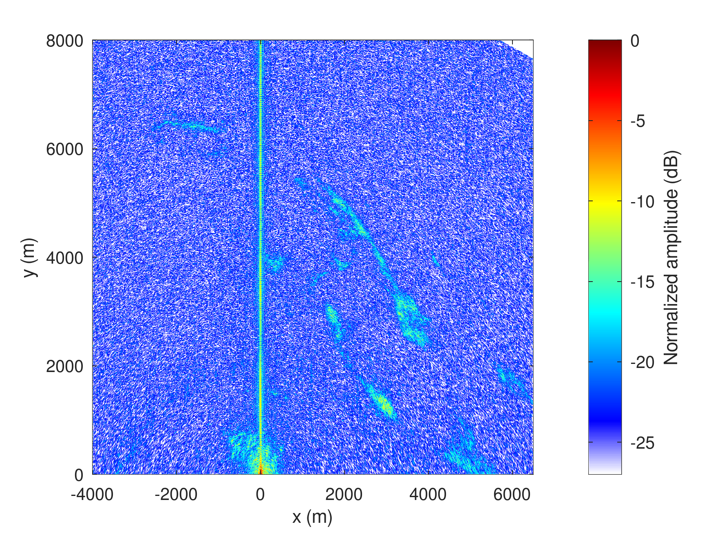

1. ``max2771process_packed.m`` to check the packed to unpacked IQ analysis and identify
the time when the beam illuminated the receivers
2. ``go_max2771_packed.m`` to identify the transmitted chirps time (save ``kpos`` in ``kpos.mat``)
3. ``nisarbmax2771_process5.m`` for range-azimuth processing

