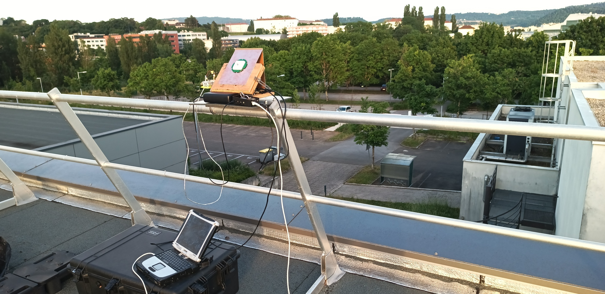
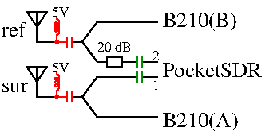

# Combined B210 and MAX2771 raw data recording

## Experimental setup





## Data acquisition

Reference is MAX2771 channel 2/B210 channel B

Surveillance is MAX2771 channel 1/B210 channel A

B210 gain A is +22 dB vs B. The B210 is connected to a NTP synchronized laptop:

```
$ sudo rm /tmp/?.bin
$ sudo nice -n -20 ./rx_multi_NISAR 
$ stat /tmp/*bin > readme
  File: /tmp/1.bin
  Size: 3124129440	Blocks: 6101816    IO Block: 4096   regular file
Device: 0,41	Inode: 53548       Links: 1
Access: (0644/-rw-r--r--)  Uid: (    0/    root)   Gid: (    0/    root)
Access: 2026-05-30 20:42:35.800885964 +0200
Modify: 2026-05-30 20:43:12.882093224 +0200
Change: 2026-05-30 20:43:12.882093224 +0200
 Birth: 2026-05-30 20:42:35.800885964 +0200
  File: /tmp/2.bin
  Size: 3124129440	Blocks: 6101816    IO Block: 4096   regular file
Device: 0,41	Inode: 53549       Links: 1
Access: (0644/-rw-r--r--)  Uid: (    0/    root)   Gid: (    0/    root)
Access: 2026-05-30 20:42:35.800885964 +0200
Modify: 2026-05-30 20:43:12.882093224 +0200
Change: 2026-05-30 20:43:12.882093224 +0200
 Birth: 2026-05-30 20:42:35.800885964 +0200
```

The MAX2771 is connected to a Raspberry Pi5 with 8 GB RAM used as RAMDisk in ``/tmp``:
```
$ sudo rm /tmp/12.bin*
$ PocketSDR/app/pocket_conf/pocket_conf pocket_NISAR_24MHz.conf
$ PocketSDR/app/pocket_dump/pocket_dump -t 120 -r /tmp/12.bin
$ ls -l
total 8916408
-rw-rw-r-- 1 jmfriedt jmfriedt 2880045056 May 30 20:47 12.bin
-rw-r--r-- 1 jmfriedt jmfriedt 3124129440 May 30 20:43 1.bin
-rw-r--r-- 1 jmfriedt jmfriedt 3124129440 May 30 20:43 2.bin
```

