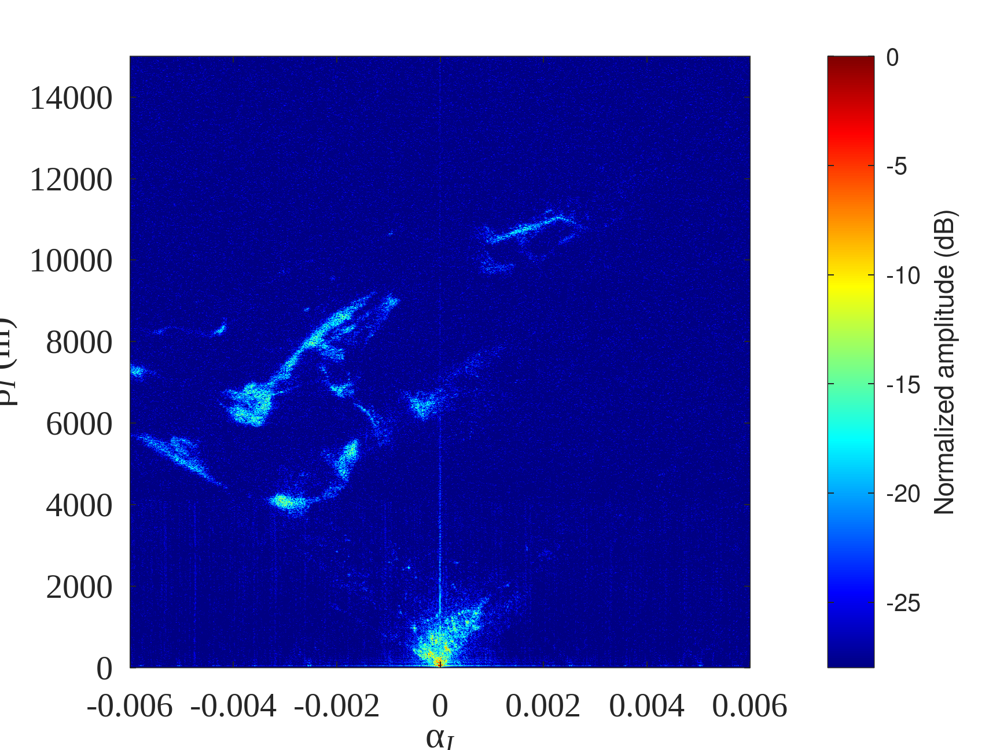
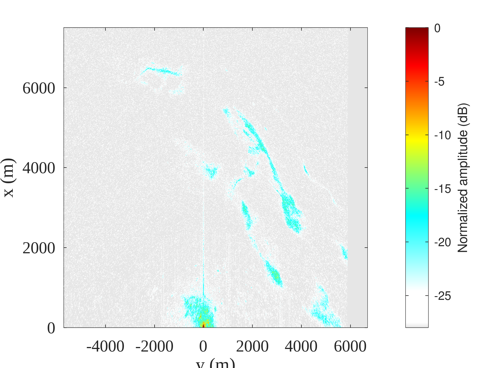
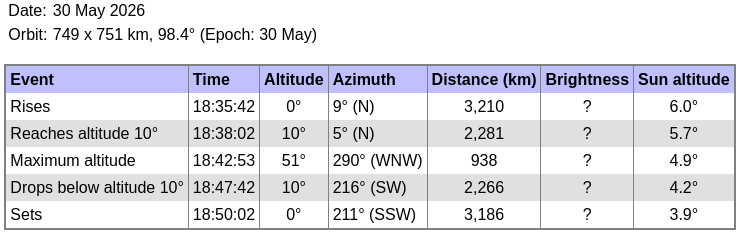

1. ``b210process.m`` to identify the time when the beam illuminated the receivers
2. ``go_b210.m`` to identify the transmitted chirps time (save ``kpos`` in ``kpos.mat``)
3. ``nisarbmaxb210_process5.m`` for range-azimuth processing






## Post-processing

1. during the acquisition, the computer is NTP synchronized so the clock should be 
accurate to within a few ms. After recording, an "exact" estimate of the file creation 
date is obtained with the ``stat`` command executed over the recorded files, stating
```
 Birth: 2026-05-30 20:42:35.800885964 +0200
```
2. When searching for the chirps (``go_b210.m``) in the reference channel (``ref.bin``), 
the index of each chirp is saved in ``kpos.mat``. To do so, the first 13 seconds 
were skipped when little signal is visible (see <a href="b210_fig3.pdf">b210_fig3.pdf</a>).
The the index is converted to time starting at ``tstart=kpos(5)/fs`` with ``fs=22 MHz``, according 
to ``nisarb210_process5.m`` which uses the iFFT for azimuth projection. Another 1.5 seconds are
added which is a time delay introduced by the recording program between creating the files and 
starting the SDR stream. The result 
```
35.800885964+13+2.5693e-03+1.5=18:42:50.30345 UTC
```
matches to within a couple of seconds the pass prediction from Heavens Above 


3. in ``predict.py``, the position of the satellite is computed from the start time to the 
stop time, resulting in ``satpos.txt`` in ECEF coordinates
4. since UTM and ICRF northing differ by 2.2 degrees, ``satpos.txt`` is rotated by +/-2.2 
degrees with 
```
t=2.2;R=[cosd(t) -sind(t) 0;sind(t) cosd(t) 0; 0 0 1]
```
but since I am not sure if the rotation should be + or -2.2 degrees, both 
``satpos+2.2.txt`` and ``satpos-2.2.txt`` files rotated by +2.2 or -2.2 degrees 
respectively were created:

```
load satpos.txt
t=2.2;R=[cosd(t) -sind(t) 0;sind(t) cosd(t) 0; 0 0 1];s=satpos*R
save -text satpos+2.txt s
t=-2.2;R=[cosd(t) -sind(t) 0;sind(t) cosd(t) 0; 0 0 1];s=satpos*R
save -text satpos-2.txt s
```
