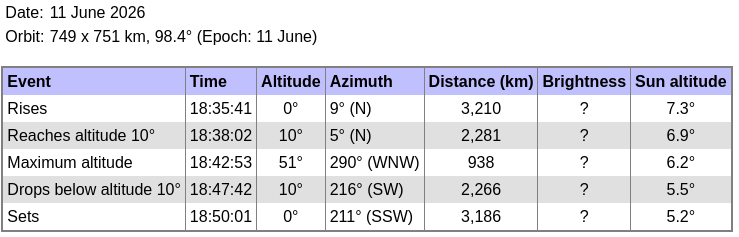
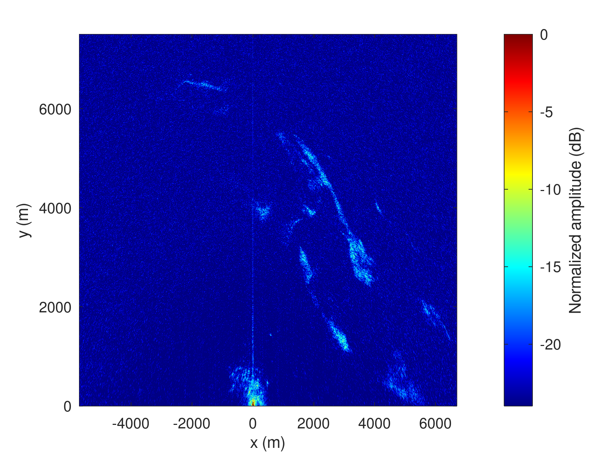
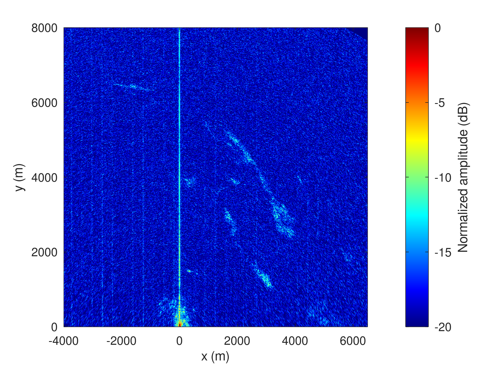

# Dual B210 (to PC) - MAX2771 PocketSDR (to RPi5) acquisition

From <a href="https://www.heavens-above.com/PassSummary.aspx?satid=65053&lat=47.2505&lng=5.9881&loc=Unnamed&alt=0&tz=UCT&showall=t">Heavens Above</a>:



## PC with B210

```
time sudo nice -n -20 ./rx_multi_NISAR
```
always stops after about 30 seconds of acquisition, so start the acquisition at 18:42:38 UTC

```
b210_to_file$ time sudo nice -n -20 ./rx_multi_NISAR

Creating the usrp device with: num_recv_frames=1024...
[INFO] [UHD] linux; GNU C++ version 15.2.0; Boost_109000; UHD_4.9.0.1-1.3
[INFO] [B200] Detected Device: B210
[INFO] [B200] Operating over USB 3.
[INFO] [B200] Initialize CODEC control...
[INFO] [B200] Initialize Radio control...
[INFO] [B200] Performing register loopback test...
[INFO] [B200] Register loopback test passed
[INFO] [B200] Performing register loopback test...
[INFO] [B200] Register loopback test passed
[INFO] [B200] Setting master clock rate selection to 'automatic'.
[INFO] [B200] Asking for clock rate 16.000000 MHz...
[INFO] [B200] Actually got clock rate 16.000000 MHz.
Using Device: Single USRP:
  Device: B-Series Device
  Mboard 0: B210
  RX Channel: 0
    RX DSP: 0
    RX Dboard: A
    RX Subdev: FE-RX2
  RX Channel: 1
    RX DSP: 1
    RX Dboard: A
    RX Subdev: FE-RX1
  TX Channel: 0
    TX DSP: 0
    TX Dboard: A
    TX Subdev: FE-TX2
  TX Channel: 1
    TX DSP: 1
    TX Dboard: A
    TX Subdev: FE-TX1

Setting RX Rate: 22.000000 Msps...
[INFO] [B200] Asking for clock rate 22.000000 MHz...
[INFO] [B200] Actually got clock rate 22.000000 MHz.
Actual RX Rate: 22.000000 Msps...

Setting RX Freq: 1229.000000 MHz...
Setting RX LO Offset: 0.000000 MHz...
Actual RX Freq: 1229.000000 MHz...

Setting RX1 Gain: 48.000000 dB...
Actual RX0 Gain: 70.000000 dB...
Actual RX1 Gain: 48.000000 dB...

Setting antennas TX/RX...

Setting device timestamp to 0...

Begin streaming 268435440 samples, 1.500000 seconds in the future...
O!!Error: Receiver error ERROR_CODE_OVERFLOW (Overflow)

real    0m34.411s
user    0m0.015s
sys     0m0.009s
```
was long enough to collect the samples when NISAR was expected to be at 
maximum elevation around 18:42:50 UTC

Exact record creation date:
```
$ stat /tmp/1.bin /tmp/2.bin 
  File: /tmp/1.bin
  Size: 2641677600      Blocks: 5159528    IO Block: 4096   regular file
Device: 0,42    Inode: 60909       Links: 1
Access: (0644/-rw-r--r--)  Uid: (    0/    root)   Gid: (    0/    root)
Access: 2026-06-11 20:42:37.554437699 +0200
Modify: 2026-06-11 20:43:09.087633208 +0200
Change: 2026-06-11 20:43:09.087633208 +0200
 Birth: 2026-06-11 20:42:37.554437699 +0200
  File: /tmp/2.bin
  Size: 2641677600      Blocks: 5159528    IO Block: 4096   regular file
Device: 0,42    Inode: 60910       Links: 1
Access: (0644/-rw-r--r--)  Uid: (    0/    root)   Gid: (    0/    root)
Access: 2026-06-11 20:42:37.554437699 +0200
Modify: 2026-06-11 20:43:09.087633208 +0200
Change: 2026-06-11 20:43:09.087633208 +0200
 Birth: 2026-06-11 20:42:37.554437699 +0200
```
Displaying the full record (``b210process.m``) shows that the signal was received
from 7 to 17 seconds of the record, so space is saved with
```
head -c 1496000000 2.bin | tail -c 880000000 > /tmp/ref.bin
head -c 1496000000 1.bin | tail -c 880000000 > /tmp/sur.bin
```
since $17\times 22\cdot 10^6 \times 2\times 2$ is the end of the useful record (x2 short and 
x2 complex) and the duration is $10\times 22\cdot 10^6\times 2\times 2$ (sampling rate is 
22 MS/s). The first 7 seconds were removed so the actual start time is
``18:42:37.554437699+7=18:42:44.554437699`` and ``kpos(1)/fs=3.309532136363636`` and adding
the 1.5 seconds inserted between file creation and B210 streaming, so
the start time is ``18:42:49.363969835363637``. This time is the one used for computing
the position of the satellite in ``predict.py``.

Result of ``nisarbmax2771_process5.m``:



## MAX2771 to RPi5

RPi IP address: ``ssh 192.168.1.63``

Recording with ``pocket_dump -r`` lastst 2 minutes without failing so launched at 18:41:53 UTC:
```
$ PocketSDR_RPi4/app/pocket_conf/pocket_conf pocket_NISAR_24MHz.conf
$ sudo PocketSDR_RPi4/app/pocket_dump/pocket_dump -t 120 -r /tmp/12.bin
  TIME(s)    T   CH1(Bytes)   RATE(Ks/s)
     67.9   IQ   1630470144      23973.4
...
  TIME(s)    T   CH1(Bytes)   RATE(Ks/s)
    120.0   IQ   2880045056      23999.8
-rw-r--r--  1 root root 2880045056 May 30 11:21 12.bin
$ ls -l /tmp/*bin
-rw-r--r-- 1 root root 2879979520 May 30 11:31 /tmp/12.bin
```

Save space by only selecting the time when the NISAR signal was detected using
``max2771process_packed.m``:
```
head -c 1584000000 /t/12.bin | tail -c 384000000 > max2771_12.bin
```

Select the record interval worth processing:
```
load all_max2771_zoom.mat
plot([1:length(xx1)]*N,xx1);axis tight
plot([1:length(xx1)]*N,abs(xx1))
kpos_max2771.mat
k=find(kpos>1.64e8);k(1)
ans = 9762
k=find(kpos>2.33e8);k(1)
ans = 15250
```

Result of ``nisarb210_process5.m``


