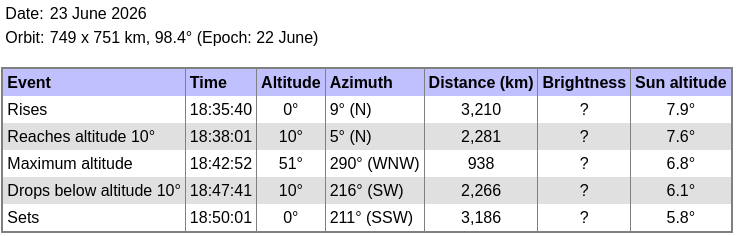

Prevision (Skyfield) : 2026 Jun 23 18:42:51 max elevation 51deg 25' 59.6" at 290deg 22' 08.0" descending
so we aim at launching the MAX2771 acquisition at 18:42:35 on the Raspberry Pi and the B210 acquisition 
at 18:42:38 on the PC

## PC log of the recoding with the B210 using ``b210_to_file``: 

```
    RX Dboard: A
    RX Subdev: FE-RX1
  TX Channel: 0
    TX DSP: 0
    TX Dboard: A
    TX Subdev: FE-TX2
  TX Channel: 1
    TX DSP: 1
    TX Dboard: A
    TX Subdev: FE-TX1

Setting RX Rate: 22.000000 Msps...
[INFO] [B200] Asking for clock rate 22.000000 MHz...
[INFO] [B200] Actually got clock rate 22.000000 MHz.
Actual RX Rate: 22.000000 Msps...

Setting RX Freq: 1229.000000 MHz...
Setting RX LO Offset: 0.000000 MHz...
Actual RX Freq: 1229.000000 MHz...

Setting RX1 Gain: 48.000000 dB...
Actual RX0 Gain: 70.000000 dB...
Actual RX1 Gain: 48.000000 dB...

Setting antennas TX/RX...

Setting device timestamp to 0...

Begin streaming 268435440 samples, 1.500000 seconds in the future...
O!!Error: Receiver error ERROR_CODE_OVERFLOW (Overflow)

real    0m28.805s
user    0m0.004s
sys     0m0.016s

```
after the files were recorded:
```
stat: 
  File: /tmp/1.bin
  Size: 2058825120	Blocks: 4021144    IO Block: 4096   regular file
Device: 0,42	Inode: 144189      Links: 1
Access: (0644/-rw-r--r--)  Uid: (    0/    root)   Gid: (    0/    root)
Access: 2026-06-23 20:42:41.611797200 +0200
Modify: 2026-06-23 20:43:07.572845407 +0200
Change: 2026-06-23 20:43:07.572845407 +0200
 Birth: 2026-06-23 20:42:41.611797200 +0200
  File: /tmp/2.bin
  Size: 2058825120	Blocks: 4021144    IO Block: 4096   regular file
Device: 0,42	Inode: 144190      Links: 1
Access: (0644/-rw-r--r--)  Uid: (    0/    root)   Gid: (    0/    root)
Access: 2026-06-23 20:42:41.615797361 +0200
Modify: 2026-06-23 20:43:07.572845407 +0200
Change: 2026-06-23 20:43:07.572845407 +0200
 Birth: 2026-06-23 20:42:41.615797361 +0200
```
and we get rid of the initial measurements (4") when no signal was present
```
octave:2> format long
octave:3> 11*22e6*2*2  % complex short
ans = 968000000
octave:4> 7*22e6*2*2
ans = 616000000

$ head -c 968000000 1.bin  | tail -c 616000000 > b210_sur.bin
$ head -c 968000000 2.bin  | tail -c 616000000 > b210_ref.bin
```

## MAX2771 acquisition on the Raspberry Pi:
```
$ sudo rm /tmp/*bin* && time sudo ./ISL/PocketSDR_RPi4/app/pocket_dump/pocket_dump -t 60 -r /tmp/12.bin
  TIME(s)    T   CH1(Bytes)   RATE(Ks/s)
     60.0   IQ   1439956992      23998.9

real    1m0.091s
user    0m0.034s
sys     0m0.021s

$ ls -lah
-rw-r--r--  1 jmfriedt jmfriedt 1.4G Jun 23 20:45 12.bin
-rw-r--r--  1 jmfriedt jmfriedt  103 Jun 23 20:45 12.bin.tag
-rw-r--r--  1 jmfriedt jmfriedt 2.0G Jun 23 20:43 1.bin
-rw-r--r--  1 jmfriedt jmfriedt 2.0G Jun 23 20:43 2.bin

octave:5> 20*24e6
ans = 480000000
octave:6> 10*24e6
ans = 240000000
octave:7> 

$ head -c 480000000 12.bin | tail -c 240000000 > max2771_12.bin

kpos(3000)/22e6
ans = 2.477456318181818
```

Calculation of the position of the satellite starting at time
```
20:42:41.611797200+4+1.5+2.477456318181818=20:42:49.58925351818181 v.s. expected 20:42:52
```


