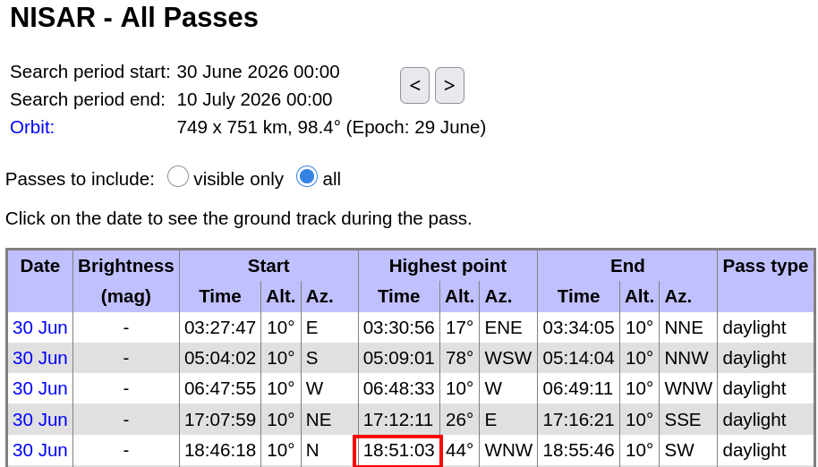
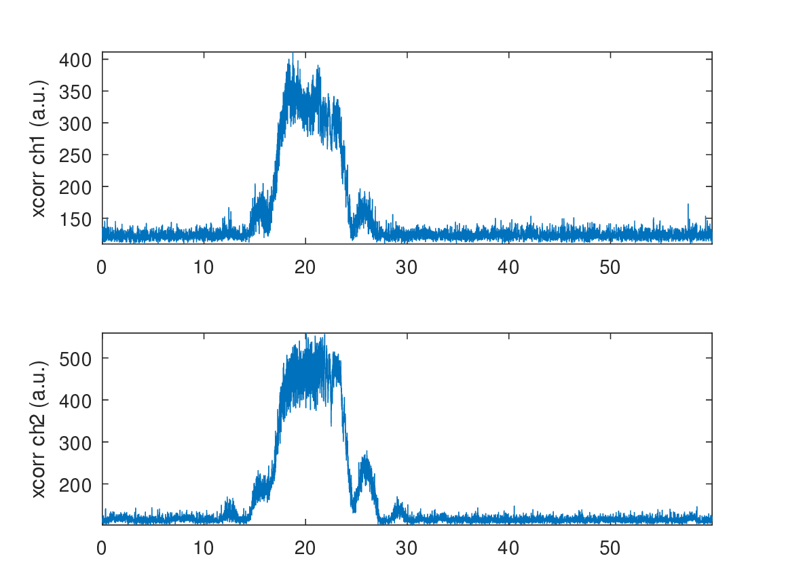

# Simultaneous B210 and MAX2771 acquisition

## Experimental setup



## B210 on PC recording through USB3 bus:

```
$ sudo nice -n -20 ../b210_to_file/rx_multi_NISAR 

Creating the usrp device with: num_recv_frames=1024...
[INFO] [UHD] linux; GNU C++ version 15.2.0; Boost_109000; UHD_4.9.0.1-1.3
[INFO] [B200] Detected Device: B210
[INFO] [B200] Operating over USB 3.
[INFO] [B200] Initialize CODEC control...
[INFO] [B200] Initialize Radio control...
[INFO] [B200] Performing register loopback test... 
[INFO] [B200] Register loopback test passed
[INFO] [B200] Performing register loopback test... 
[INFO] [B200] Register loopback test passed
[INFO] [B200] Setting master clock rate selection to 'automatic'.
[INFO] [B200] Asking for clock rate 16.000000 MHz... 
[INFO] [B200] Actually got clock rate 16.000000 MHz.
Using Device: Single USRP:
  Device: B-Series Device
  Mboard 0: B210
  RX Channel: 0
    RX DSP: 0
    RX Dboard: A
    RX Subdev: FE-RX2
  RX Channel: 1
    RX DSP: 1
    RX Dboard: A
    RX Subdev: FE-RX1
  TX Channel: 0
    TX DSP: 0
    TX Dboard: A
    TX Subdev: FE-TX2
  TX Channel: 1
    TX DSP: 1
    TX Dboard: A
    TX Subdev: FE-TX1

Setting RX Rate: 22.000000 Msps...
[INFO] [B200] Asking for clock rate 22.000000 MHz... 
[INFO] [B200] Actually got clock rate 22.000000 MHz.
Actual RX Rate: 22.000000 Msps...

Setting RX Freq: 1229.000000 MHz...
Setting RX LO Offset: 0.000000 MHz...
Actual RX Freq: 1229.000000 MHz...

Setting RX1 Gain: 48.000000 dB...
Actual RX0 Gain: 70.000000 dB...
Actual RX1 Gain: 48.000000 dB...

Setting antennas TX/RX...

Setting device timestamp to 0...

Begin streaming 268435440 samples, 1.500000 seconds in the future...
O!!Error: Receiver error ERROR_CODE_OVERFLOW (Overflow)
```
and resulting recording accurate timestamp (NTP synchronized laptop):
```
  File: /tmp/1.bin
  Size: 4550872800	Blocks: 8888424    IO Block: 4096   regular file
Device: 0,42	Inode: 1923        Links: 1
Access: (0644/-rw-r--r--)  Uid: (    0/    root)   Gid: (    0/    root)
Access: 2026-06-30 20:50:47.191143085 +0200
Modify: 2026-06-30 20:51:40.884900714 +0200
Change: 2026-06-30 20:51:40.884900714 +0200
 Birth: 2026-06-30 20:50:47.191143085 +0200
  File: /tmp/2.bin
  Size: 4550872800	Blocks: 8888424    IO Block: 4096   regular file
Device: 0,42	Inode: 1924        Links: 1
Access: (0644/-rw-r--r--)  Uid: (    0/    root)   Gid: (    0/    root)
Access: 2026-06-30 20:50:47.191143085 +0200
Modify: 2026-06-30 20:51:40.884900714 +0200
Change: 2026-06-30 20:51:40.884900714 +0200
 Birth: 2026-06-30 20:50:47.191143085 +0200
```
Resulting analysis using ``b210process.m``

Top surveillance, bottom reference channels (cross correlation magnitude maximum)


Cutting the relevant part of the dataset to save space:
```
octave:3> 15*22e6*2*2
ans = 1320000000
octave:4> 8*22e6*2*2
ans = 704000000

$ head -c 1320000000 /tmp/1.bin  | tail -c 704000000 > b210_1sur.bin
$ head -c 1320000000 /tmp/2.bin  | tail -c 704000000 > b210_2ref.bin
```

## MAX2771 recording from the Raspberry Pi



Cutting the relevant part of the dataset to save space:

```
octave:7> 24e6*30
ans = 720000000
octave:8> 24e6*16
ans = 384000000

$ head -c 720000000 12.bin  | tail -c 384000000 > max2771_12.bin
```
