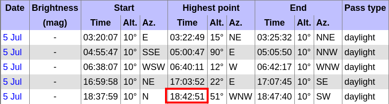
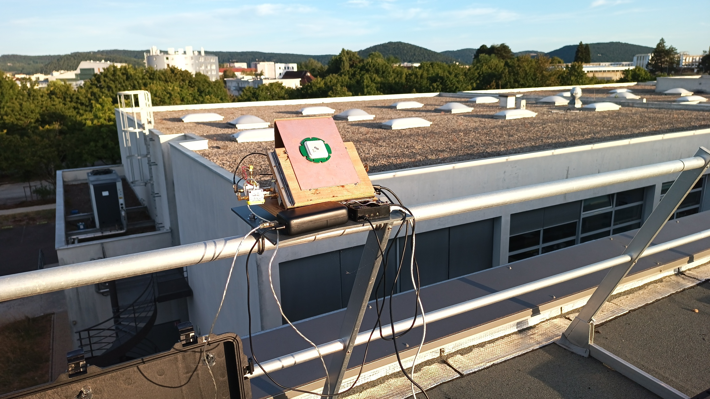
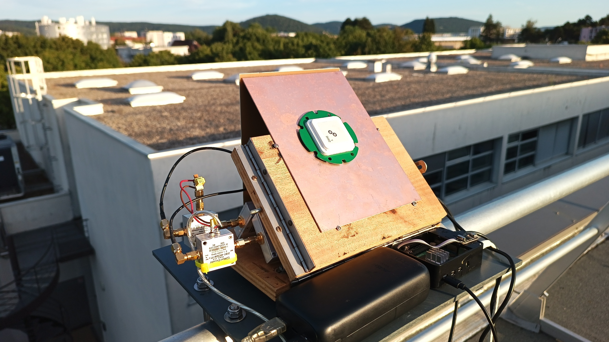
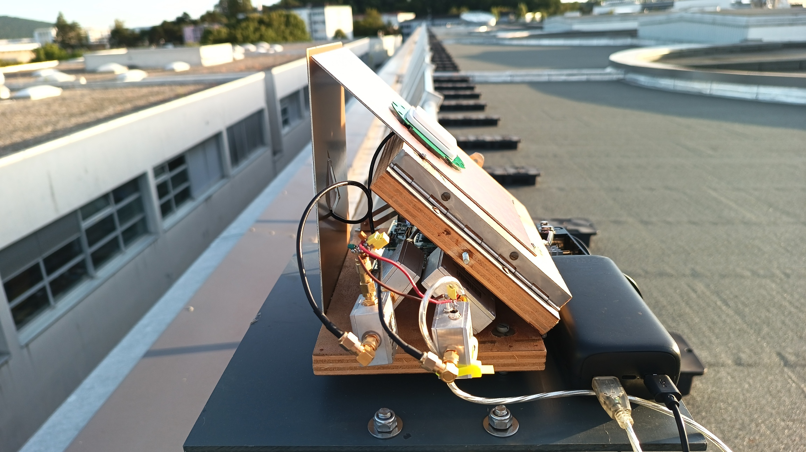
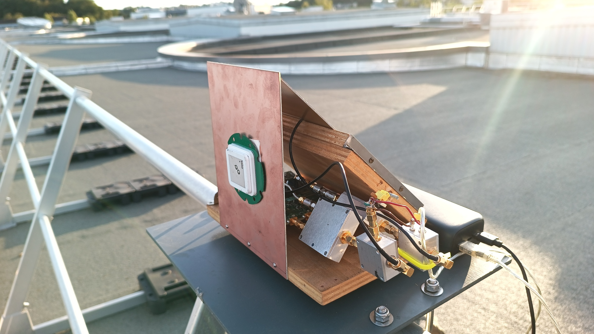
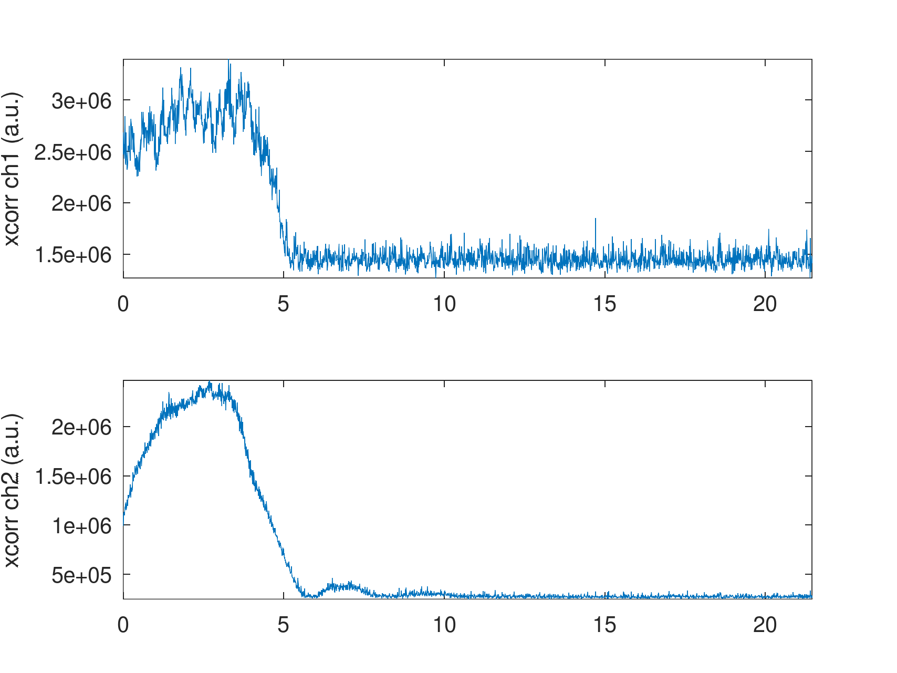
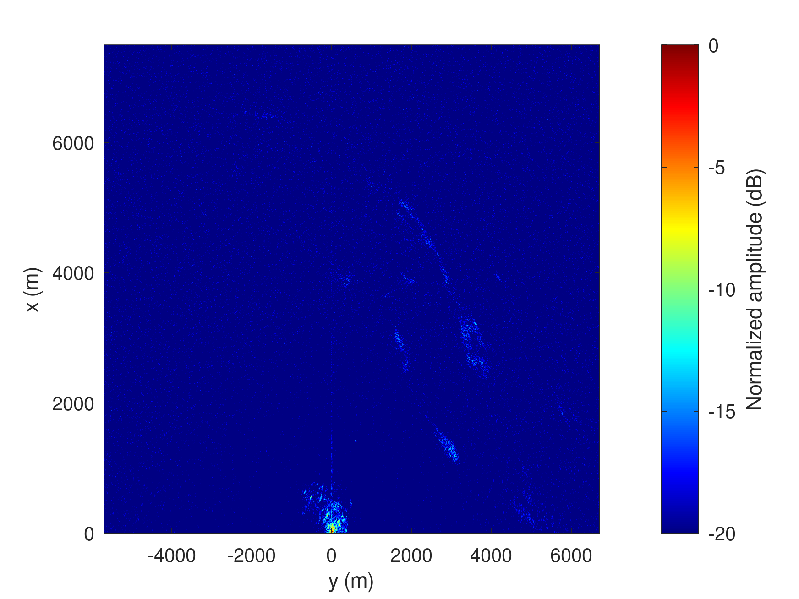
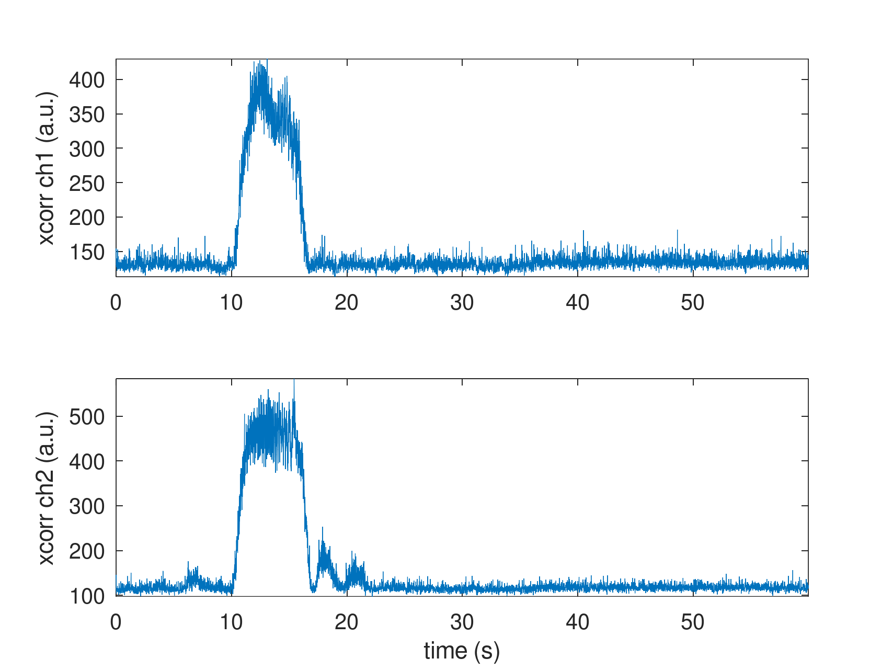
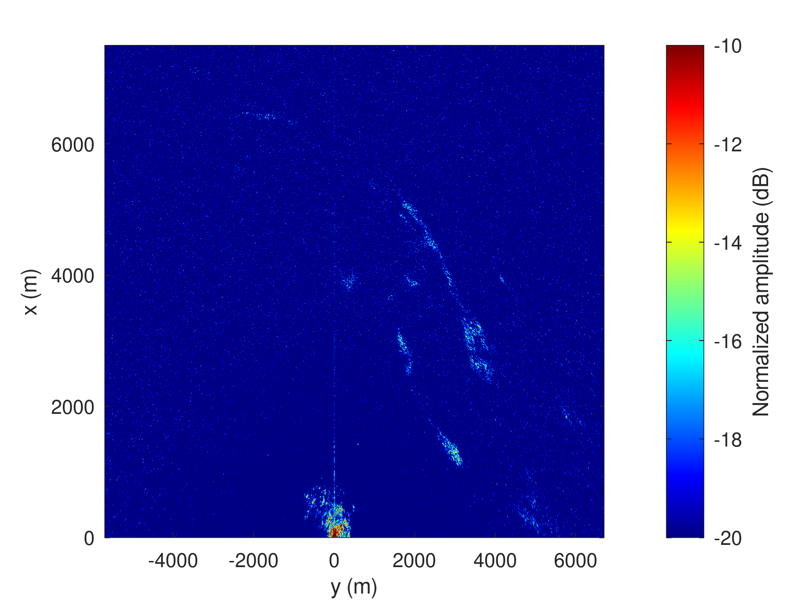

MAX2771 launched around 20:42:37

B210    launched around 20:42:46

## B210

```
    RX Dboard: A
    RX Subdev: FE-RX1
  TX Channel: 0
    TX DSP: 0
    TX Dboard: A
    TX Subdev: FE-TX2
  TX Channel: 1
    TX DSP: 1
    TX Dboard: A
    TX Subdev: FE-TX1

Setting RX Rate: 22.000000 Msps...
[INFO] [B200] Asking for clock rate 22.000000 MHz...
[INFO] [B200] Actually got clock rate 22.000000 MHz.
Actual RX Rate: 22.000000 Msps...

Setting RX Freq: 1229.000000 MHz...
Setting RX LO Offset: 0.000000 MHz...
Actual RX Freq: 1229.000000 MHz...

Setting RX1 Gain: 48.000000 dB...
Actual RX0 Gain: 70.000000 dB...
Actual RX1 Gain: 48.000000 dB...

Setting antennas TX/RX...

Setting device timestamp to 0...

Begin streaming 268435440 samples, 1.500000 seconds in the future...
!!OError: Receiver error ERROR_CODE_OVERFLOW (Overflow)

real    0m25.907s
user    0m6.422s
sys     0m13.830s
```

```
  File: /tmp/1.bin
  Size: 1888999200	Blocks: 3689456    IO Block: 4096   regular file
Device: 0,42	Inode: 29710       Links: 1
Access: (0664/-rw-rw-r--)  Uid: ( 1000/jmfriedt)   Gid: ( 1000/jmfriedt)
Access: 2026-07-05 20:42:45.706624411 +0200
Modify: 2026-07-05 20:43:08.727381399 +0200
Change: 2026-07-05 20:43:08.727381399 +0200
 Birth: 2026-07-05 20:42:45.706624411 +0200
  File: /tmp/2.bin
  Size: 1888999200	Blocks: 3689456    IO Block: 4096   regular file
Device: 0,42	Inode: 29711       Links: 1
Access: (0664/-rw-rw-r--)  Uid: ( 1000/jmfriedt)   Gid: ( 1000/jmfriedt)
Access: 2026-07-05 20:42:45.706624411 +0200
Modify: 2026-07-05 20:43:08.715381005 +0200
Change: 2026-07-05 20:43:08.715381005 +0200
 Birth: 2026-07-05 20:42:45.706624411 +0200
```





## MAX2771

```
$ ./app/pocket_conf/pocket_conf pocket_NISAR_24MHz.conf
Pocket SDR device settings are changed.
$ sudo rm /tmp/*bin* && time sudo ./PocketSDR_RPi4/app/pocket_dump/pocket_dump -t 60 -r /tmp/12.bin
  TIME(s)    T   CH1(Bytes)   RATE(Ks/s)
     60.0   IQ   1439956992      23998.5

real    1m0.091s
user    0m0.021s
sys     0m0.043s
```

```
octave:11> 22e6*5*2*2
ans = 440000000

$ head -c 440000000 /tmp/1.bin > b210_1sur.bin
$ head -c 440000000 /tmp/2.bin > b210_2ref.bin
```

```
octave:7> 17*24e6
ans = 408000000
octave:8> 7*24e6
ans = 168000000
 
$ cat 12.bin | head -c 408000000 | tail -c 168000000 > max2771_12.bin
```




