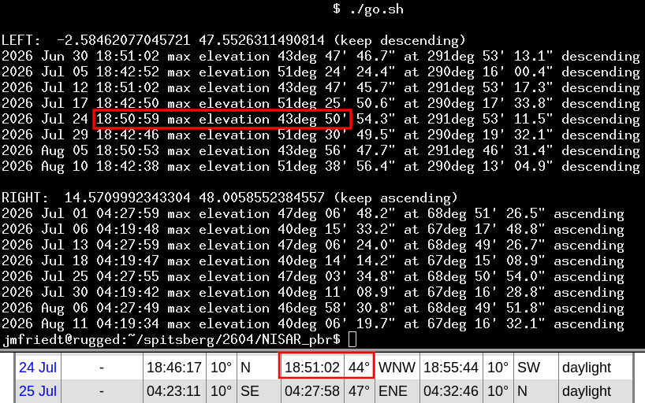

# MAX2771 and B210 NISAR data collection



## MAX2771 on Raspberry Pi 5 (ramdisk)

```
$ ssh 192.168.1.44
$ sudo PocketSDR_RPi4/app/pocket_conf/pocket_conf pocket_NISAR_24MHz.conf 
$ sudo rm /tmp/?.bin* && sudo PocketSDR_RPi4/app/pocket_dump/pocket_dump -t 60 /tmp/1.bin /tmp/2.bin
  TIME(s)    T   CH1(Bytes)   T   CH2(Bytes)   RATE(Ks/s)
     44.0   IQ   2110914560  IQ   2110914560      23990.9
...
```

Post-processing, selecting only the useful part of the record from 5 to 12 seconds:
```
octave> 12*24e6*2
ans = 576000000
octave> 7*24e6*2
ans = 336000000
$ cat 1.bin | head -c 576000000 | tail -c 336000000 > 1sur.bin
$ cat 2.bin | head -c 576000000 | tail -c 336000000 > 2ref.bin
```

## B210 on CF-19 laptop

@ 20:50
```
$ sudo rm /tmp/?.bin* && time sudo nice -n -20 ./rx_multi_NISAR 
...
    RX Dboard: A
    RX Subdev: FE-RX1
  TX Channel: 0
    TX DSP: 0
    TX Dboard: A
    TX Subdev: FE-TX2
  TX Channel: 1
    TX DSP: 1
    TX Dboard: A
    TX Subdev: FE-TX1

Setting RX Rate: 22.000000 Msps...
[INFO] [B200] Asking for clock rate 22.000000 MHz...
[INFO] [B200] Actually got clock rate 22.000000 MHz.
Actual RX Rate: 22.000000 Msps...

Setting RX Freq: 1229.000000 MHz...
Setting RX LO Offset: 0.000000 MHz...
Actual RX Freq: 1229.000000 MHz...

Setting RX1 Gain: 48.000000 dB...
Actual RX0 Gain: 70.000000 dB...
Actual RX1 Gain: 48.000000 dB...

Setting antennas TX/RX...

Setting device timestamp to 0...

Begin streaming 268435440 samples, 1.500000 seconds in the future...
!!OError: Receiver error ERROR_CODE_OVERFLOW (Overflow)

real    0m19.266s
user    0m0.015s
sys     0m0.007s
```

Data collection timestamp (file creation date):
```
  File: /tmp/1.bin
  Size: 1283576160	Blocks: 2506992    IO Block: 4096   regular file
Device: 0,36	Inode: 56387       Links: 1
Access: (0644/-rw-r--r--)  Uid: (    0/    root)   Gid: (    0/    root)
Access: 2026-07-24 20:50:56.550994663 +0200
Modify: 2026-07-24 20:51:12.683539724 +0200
Change: 2026-07-24 20:51:12.683539724 +0200
 Birth: 2026-07-24 20:50:56.550994663 +0200
  File: /tmp/2.bin
  Size: 1283576160	Blocks: 2506992    IO Block: 4096   regular file
Device: 0,36	Inode: 56388       Links: 1
Access: (0644/-rw-r--r--)  Uid: (    0/    root)   Gid: (    0/    root)
Access: 2026-07-24 20:50:56.550994663 +0200
Modify: 2026-07-24 20:51:12.683539724 +0200
Change: 2026-07-24 20:51:12.683539724 +0200
 Birth: 2026-07-24 20:50:56.550994663 +0200
```
Selecting the useful part of the record (first 6 seconds, complex short integers):
```
octave> 6*22e6*2*2
ans = 528000000
$ head -c 528000000 1.bin > 1sur.bin
```
