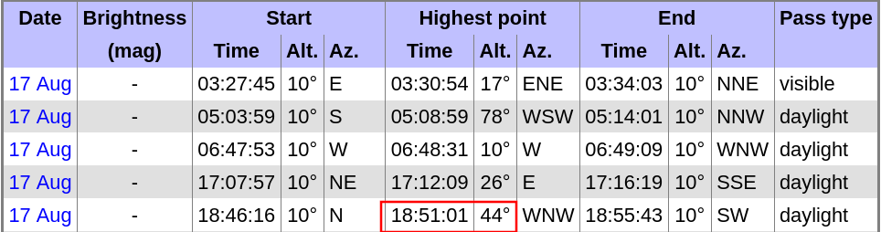
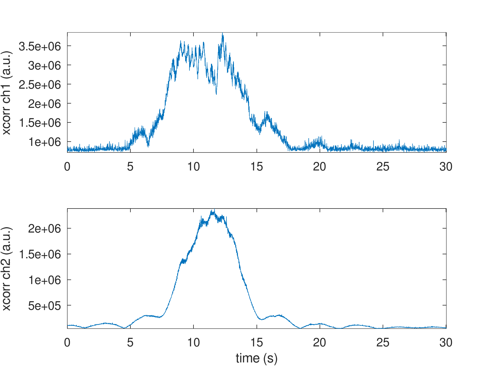
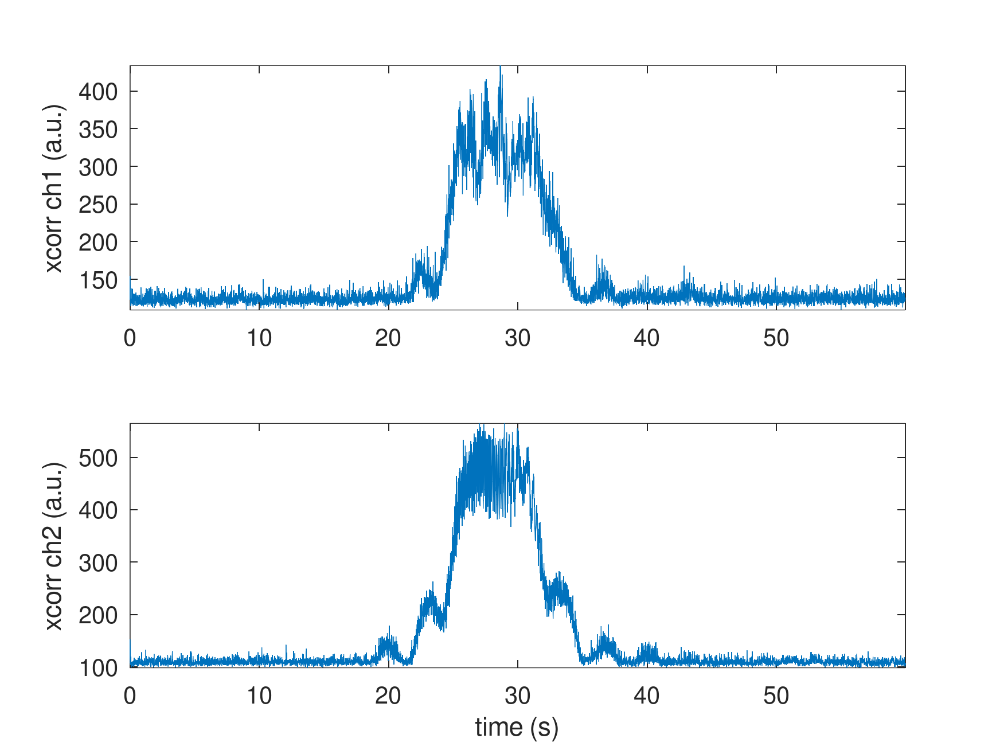
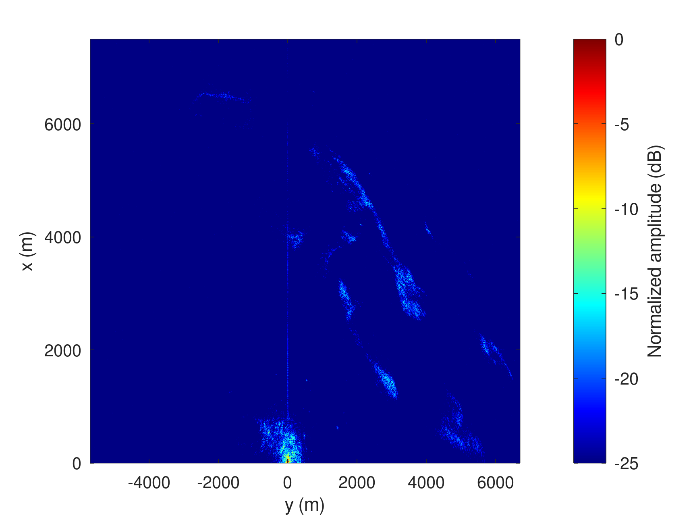
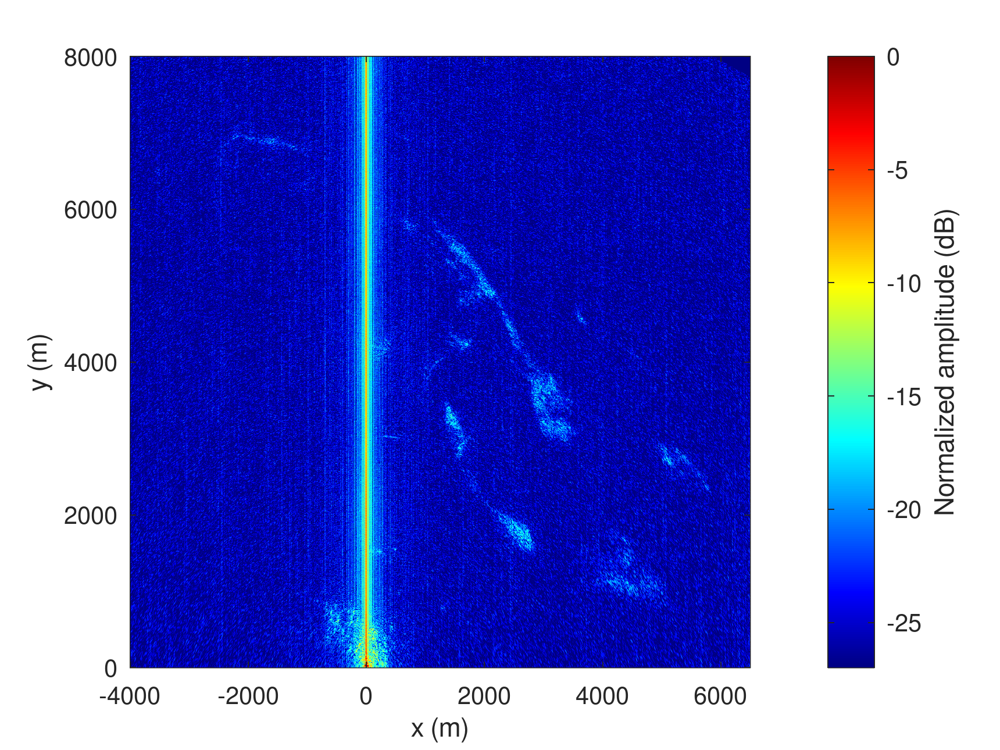

# NISAR and MAX2771 PocketSDR simultaneous acquisition

Flight at 44 deg. elevation at 18:51 UTC



## MAX2771 / Raspberry Pi 5

Start at 20:50:30
```
$ sudo rm /tmp/*bin* && sudo ./PocketSDR/app/pocket_dump/pocket_dump -t 60 -r /tmp/12.bin
 TIME(s)      RAW8(B) RATE(Ks/s)
    21.0    504365056    24021.2
...
    60.0   1439694848    23991.7
```
After processing:
```
octave> 24e6*34
ans = 816000000
octave> 24e6*10
ans = 240000000
```
so
```
$ head -c 816000000 12.bin | tail -c 240000000 > 12zoom.bin
```

## B210 on PC

Launch around 20:50:45 (because the USB communication collapses after
about 30 seconds):

```
$ sudo rm /tmp/*bin* && time sudo nice -n -20 ../b210_to_file/rx_multi_NISAR

Creating the usrp device with: num_recv_frames=1024...
[INFO] [UHD] linux; GNU C++ version 16.1.0; Boost_109000; UHD_4.9.0.1-1.4
[INFO] [B200] Detected Device: B210
[INFO] [B200] Operating over USB 3.
[INFO] [B200] Initialize CODEC control...
[INFO] [B200] Initialize Radio control...
[INFO] [B200] Performing register loopback test...
[INFO] [B200] Register loopback test passed
[INFO] [B200] Performing register loopback test...
[INFO] [B200] Register loopback test passed
[INFO] [B200] Setting master clock rate selection to 'automatic'.
[INFO] [B200] Asking for clock rate 16.000000 MHz...
[INFO] [B200] Actually got clock rate 16.000000 MHz.
Using Device: Single USRP:
  Device: B-Series Device
  Mboard 0: B210
  RX Channel: 0
    RX DSP: 0
    RX Dboard: A
    RX Subdev: FE-RX2
  RX Channel: 1
    RX DSP: 1
    RX Dboard: A
    RX Subdev: FE-RX1
  TX Channel: 0
    TX DSP: 0
    TX Dboard: A
    TX Subdev: FE-TX2
  TX Channel: 1
    TX DSP: 1
    TX Dboard: A
    TX Subdev: FE-TX1

Setting RX Rate: 22.000000 Msps...
[INFO] [B200] Asking for clock rate 22.000000 MHz...
[INFO] [B200] Actually got clock rate 22.000000 MHz.
Actual RX Rate: 22.000000 Msps...

Setting RX Freq: 1229.000000 MHz...
Setting RX LO Offset: 0.000000 MHz...
Actual RX Freq: 1229.000000 MHz...

Setting RX1 Gain: 48.000000 dB...
Actual RX0 Gain: 70.000000 dB...
Actual RX1 Gain: 48.000000 dB...

Setting antennas TX/RX...

Setting device timestamp to 0...

Begin streaming 268435440 samples, 1.500000 seconds in the future...
!!OError: Receiver error ERROR_CODE_OVERFLOW (Overflow)

real    0m34.385s
user    0m0.005s
sys     0m0.014s
```

The ``stat`` on the recorded files (the computer is NTP synchronized):
```
  File: /tmp/1.bin
  Size: 2642950560	Blocks: 5162016    IO Block: 4096   regular file
Device: 0,41	Inode: 146637      Links: 1
Access: (0644/-rw-r--r--)  Uid: (    0/    root)   Gid: (    0/    root)
Access: 2026-08-17 20:50:45.260392059 +0200
Modify: 2026-08-17 20:51:16.873316930 +0200
Change: 2026-08-17 20:51:16.873316930 +0200
 Birth: 2026-08-17 20:50:45.260392059 +0200
  File: /tmp/2.bin
  Size: 2642950560	Blocks: 5162016    IO Block: 4096   regular file
Device: 0,41	Inode: 146638      Links: 1
Access: (0644/-rw-r--r--)  Uid: (    0/    root)   Gid: (    0/    root)
Access: 2026-08-17 20:50:45.260392059 +0200
Modify: 2026-08-17 20:51:16.873316930 +0200
Change: 2026-08-17 20:51:16.873316930 +0200
 Birth: 2026-08-17 20:50:45.260392059 +0200
```
After processing:
```
octave> 22e6*2*2*15
ans = 1320000000
octave> 22e6*2*2*8
ans = 704000000
``` 
so
```
$ head -c 1320000000 1.bin | tail -c 704000000 1.bin > 1sur.bin
$ head -c 1320000000 2.bin | tail -c 704000000 1.bin > 2ref.bin
```

## Results

Cross-correlation of the IQ data with a synthetic copy of the chirp, indicating the acquisition
was successful:




Range-azimuth compression results:



