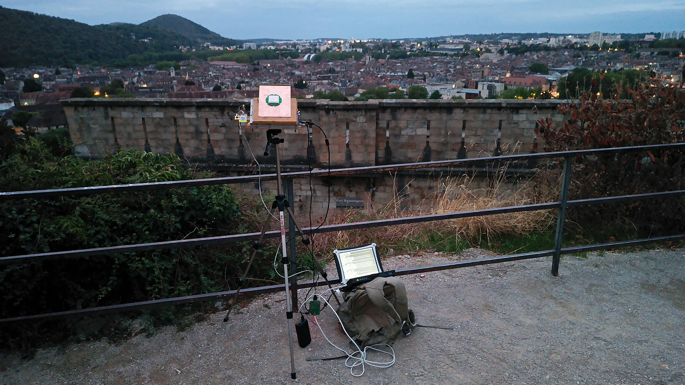
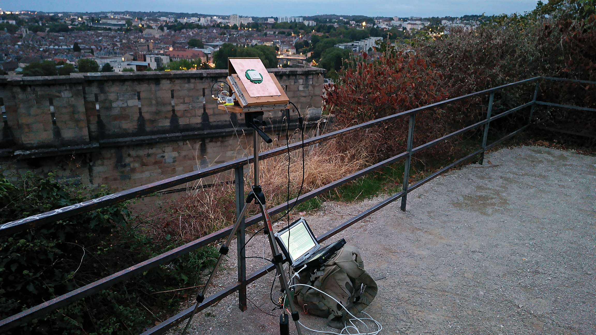
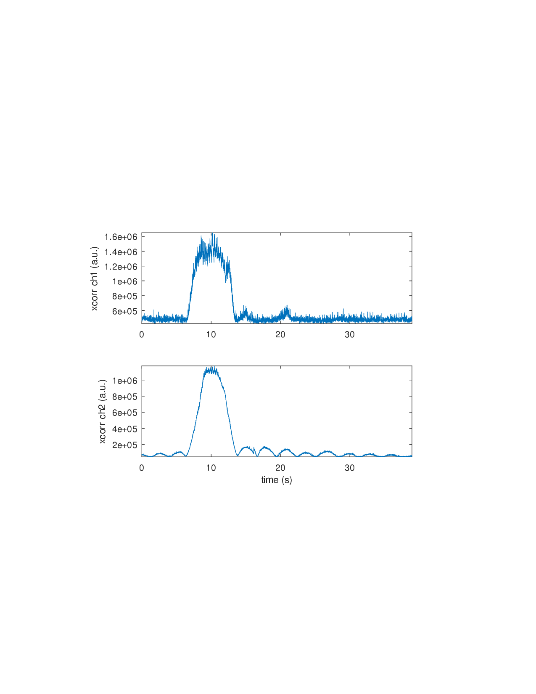
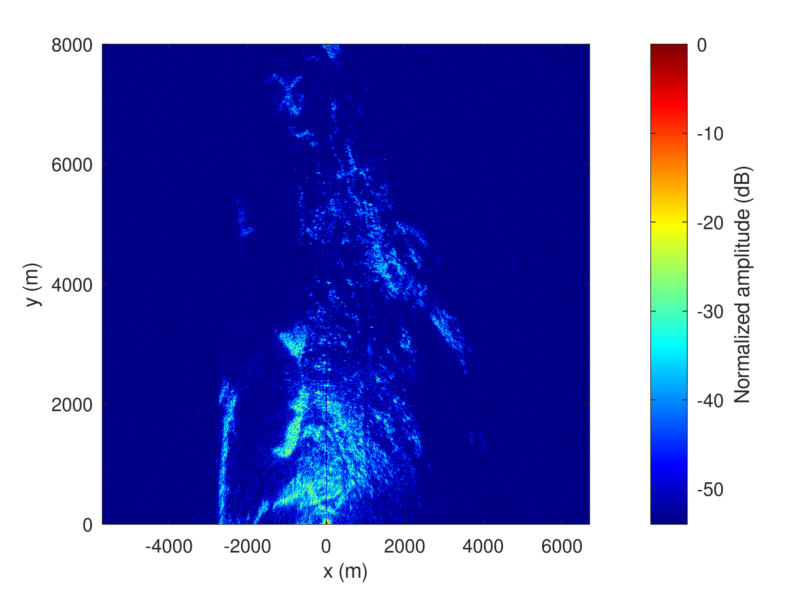
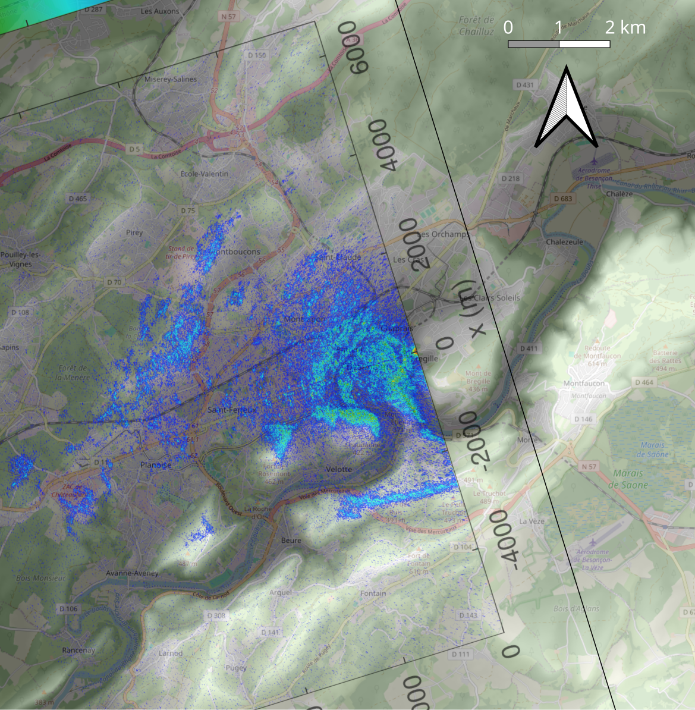
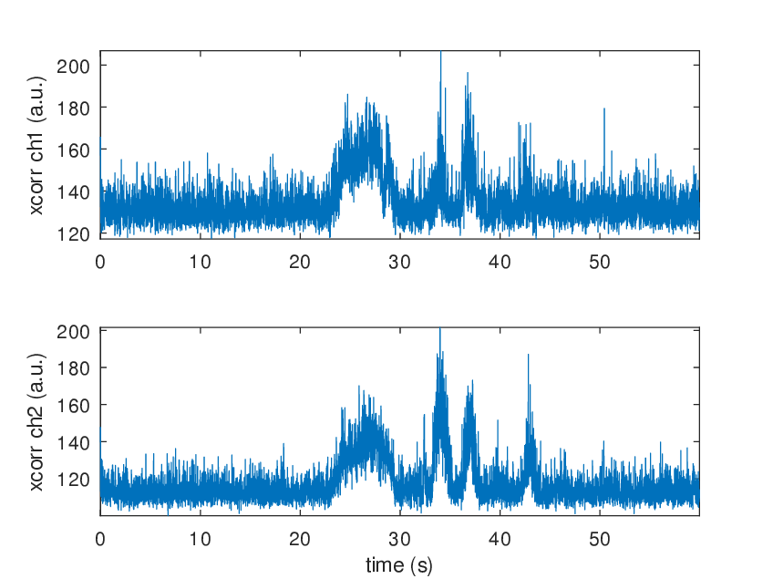

# Ascending pass





## B210 on laptop computer

Acquisition launched around 6:50:45

```
$ sudo rm /tmp/*bin && time sudo nice -n -20 ./rx_multi_NISAR
...
    RX Dboard: A
    RX Subdev: FE-RX1
  TX Channel: 0
    TX DSP: 0
    TX Dboard: A
    TX Subdev: FE-TX2
  TX Channel: 1
    TX DSP: 1
    TX Dboard: A
    TX Subdev: FE-TX1

Setting RX Rate: 22.000000 Msps...
[INFO] [B200] Asking for clock rate 22.000000 MHz... 
[INFO] [B200] Actually got clock rate 22.000000 MHz.
Actual RX Rate: 22.000000 Msps...

Setting RX Freq: 1229.000000 MHz...
Setting RX LO Offset: 0.000000 MHz...
Actual RX Freq: 1229.000000 MHz...

Setting RX1 Gain: 48.000000 dB...
Actual RX0 Gain: 70.000000 dB...
Actual RX1 Gain: 48.000000 dB...

Setting antennas TX/RX...

Setting device timestamp to 0...

Begin streaming 268435440 samples, 1.500000 seconds in the future...
!!OError: Receiver error ERROR_CODE_OVERFLOW (Overflow)

real    0m43.207s
user    0m0.007s
sys     0m0.013s

$ stat /tmp/*bin

  File: /tmp/1.bin
  Size: 3430733280	Blocks: 6700656    IO Block: 4096   regular file
Device: 0,41	Inode: 223501      Links: 1
Access: (0644/-rw-r--r--)  Uid: (    0/    root)   Gid: (    0/    root)
Access: 2026-08-30 06:29:16.085273808 +0200
Modify: 2026-08-30 06:28:20.819645768 +0200
Change: 2026-08-30 06:28:20.819645768 +0200
 Birth: 2026-08-30 06:27:40.294451964 +0200
  File: /tmp/2.bin
  Size: 3430733280	Blocks: 6700656    IO Block: 4096   regular file
Device: 0,41	Inode: 223502      Links: 1
Access: (0644/-rw-r--r--)  Uid: (    0/    root)   Gid: (    0/    root)
Access: 2026-08-30 06:29:57.450492353 +0200
Modify: 2026-08-30 06:28:20.819645768 +0200
Change: 2026-08-30 06:28:20.819645768 +0200
 Birth: 2026-08-30 06:27:40.294451964 +0200
```



Post processing to skeep only the relevant data:
```
octave> 13.5*22e6*2*2
ans = 1188000000
octave> 7*22e6*2*2
ans = 616000000

$ head -c 1188000000 1.bin | tail -c 616000000 > 1sur.bin
$ head -c 1188000000 2.bin | tail -c 616000000 > 2ref.bin
```





## MAX2771 PocketSDR clone (failed)

Launched around 6:27:26.

```
raspberrypi:~ $ sudo ./PocketSDR/app/pocket_conf/pocket_conf pocket_NISAR_24MHz.conf         
Pocket SDR device settings are changed.
raspberrypi:~ $ sudo rm /tmp/*bin* && sudo ./PocketSDR/app/pocket_dump/pocket_dump -t 60  -r /tmp/12.bin
 TIME(s)      RAW8(B) RATE(Ks/s)
    60.0   1439694848    23991.3
```

Postprocessing:

```
octave> 30*24e6
ans = 720000000
octave> 7*24e6
ans = 168000000
```



Poor signal to noise ratio, reason unknown.

