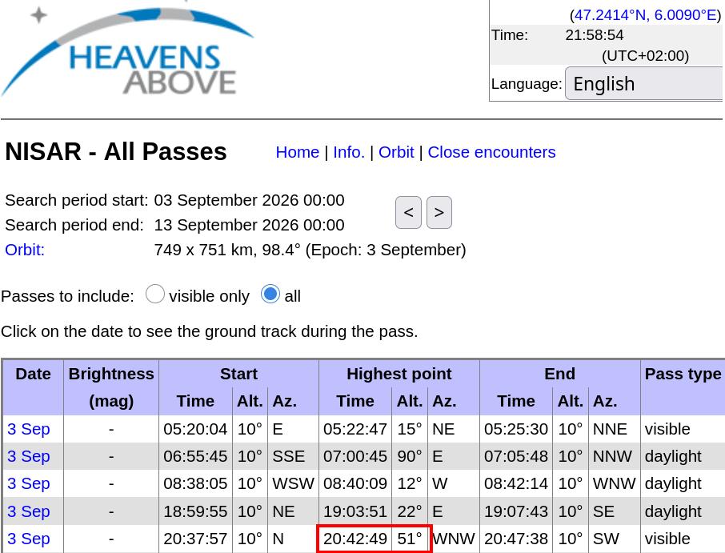
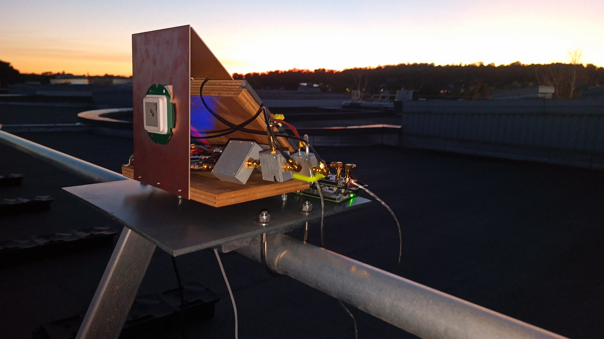
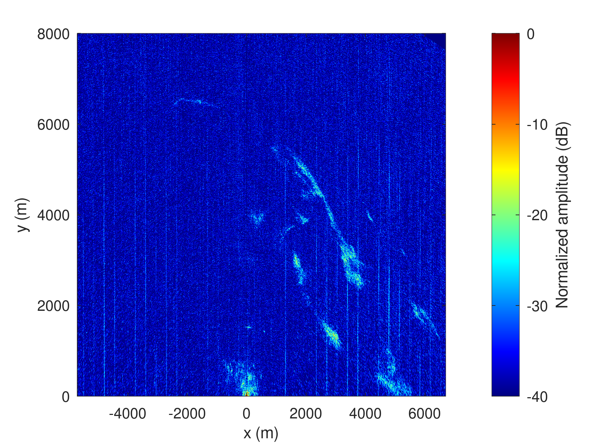
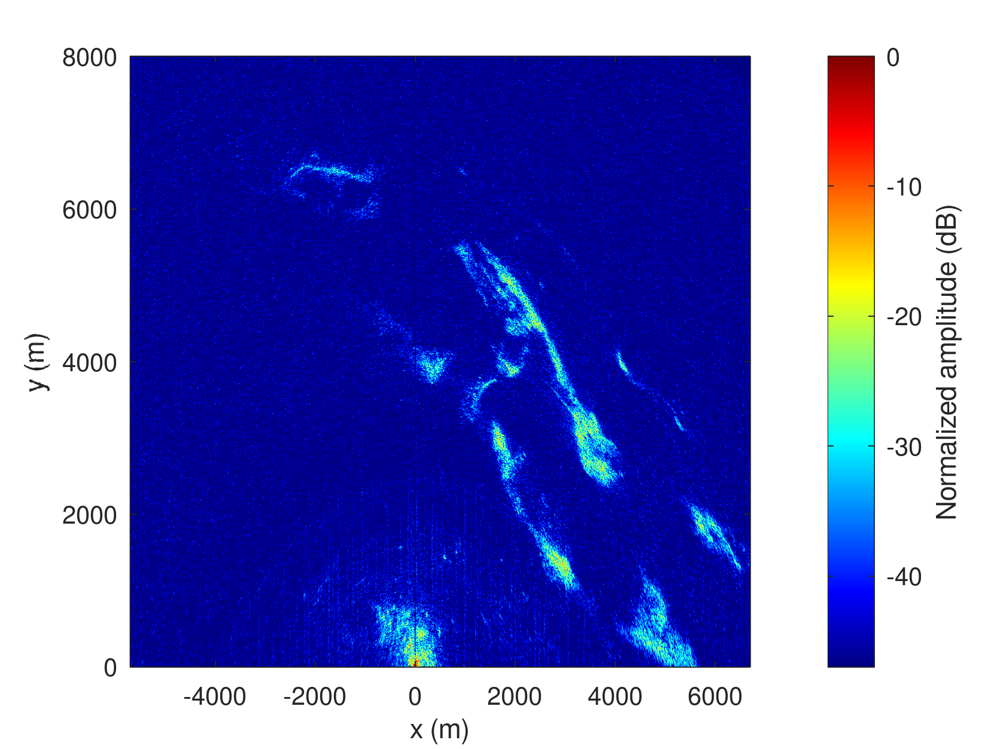

# B210 and MAX2771 PocketSDR clone acquisition





## B210

Around 20:42:34 launch of B210.

```
b210_to_file$ sudo rm /tmp/*bin && time sudo nice -n -20 ./rx_multi_NISAR 
...
    RX DSP: 0
    RX Dboard: A
    RX Subdev: FE-RX2
  RX Channel: 1
    RX DSP: 1
    RX Dboard: A
    RX Subdev: FE-RX1
  TX Channel: 0
    TX DSP: 0
    TX Dboard: A
    TX Subdev: FE-TX2
  TX Channel: 1
    TX DSP: 1
    TX Dboard: A
    TX Subdev: FE-TX1

Setting RX Rate: 22.000000 Msps...
[INFO] [B200] Asking for clock rate 22.000000 MHz...
[INFO] [B200] Actually got clock rate 22.000000 MHz.
Actual RX Rate: 22.000000 Msps...

Setting RX Freq: 1229.000000 MHz...
Setting RX LO Offset: 0.000000 MHz...
Actual RX Freq: 1229.000000 MHz...

Setting RX1 Gain: 48.000000 dB...
Actual RX0 Gain: 70.000000 dB...
Actual RX1 Gain: 48.000000 dB...

Setting antennas TX/RX...

Setting device timestamp to 0...

Begin streaming 268435440 samples, 1.500000 seconds in the future...
O!!Error: Receiver error ERROR_CODE_OVERFLOW (Overflow)

real    0m40.654s
user    0m0.001s
sys     0m0.016s

$ stat /tmp/*bin
  File: /tmp/1.bin
  Size: 3177104160	Blocks: 6205288    IO Block: 4096   regular file
Device: 0,41	Inode: 243813      Links: 1
Access: (0644/-rw-r--r--)  Uid: (    0/    root)   Gid: (    0/    root)
Access: 2026-09-03 20:42:37.193258404 +0200
Modify: 2026-09-03 20:43:14.970383927 +0200
Change: 2026-09-03 20:43:14.970383927 +0200
 Birth: 2026-09-03 20:42:37.193258404 +0200
  File: /tmp/2.bin
  Size: 3177104160	Blocks: 6205288    IO Block: 4096   regular file
Device: 0,41	Inode: 243814      Links: 1
Access: (0644/-rw-r--r--)  Uid: (    0/    root)   Gid: (    0/    root)
Access: 2026-09-03 20:42:37.193258404 +0200
Modify: 2026-09-03 20:43:14.938382973 +0200
Change: 2026-09-03 20:43:14.938382973 +0200
 Birth: 2026-09-03 20:42:37.193258404 +0200
```

* ``octave:> b210process``
with
```
f1=fopen('1.bin'); % 1
f2=fopen('2.bin'); % 2
```
Manually select the end time and duration, and calculate the number of samples
```
octave:> 13*22e6*2*2
ans = 1144000000
octave:> 7*22e6*2*2
ans = 616000000
```
```
$ cat 1.bin | head -c 1144000000 | tail -c 616000000 > 1sur.bin
$ cat 2.bin | head -c 1144000000 | tail -c 616000000 > 2ref.bin
```

Rerun ``b210process`` with
```
f1=fopen('1sur.bin'); % 1
f2=fopen('2ref.bin'); % 2
```
to check the zoom and delete {1,2}.bin
```
octave:> go_b210
```
to identify chirp positions. Finally

```
octave:> nisarb210_process5
```
for iFFT method azimuth compression:



## MAX2771 PocketSDR clone

20:42:19 launch of MAX2771.

```
raspberrypi:~ $ sudo ./PocketSDR/app/pocket_conf/pocket_conf pocket_NISAR_24MHz.conf
Pocket SDR device settings are changed.
raspberrypi:~ $ sudo rm /tmp/*bin* && sudo ./PocketSDR/app/pocket_dump/pocket_dump -t 60 -r /tmp/12.bin
 TIME(s)      RAW8(B) RATE(Ks/s)
    60.0   1439694848    23992.1
```
Process:
```
octave:> max2771process_packed
```
with
```
f=fopen('12.bin');
```
to identify the reception time by manually selecting the end time and duration, and 
calculate the number of samples
```
octave:> 24e6*30
ans = 720000000
octave:> 24e6*7
ans = 168000000
```
crop the appropriate file subset
```
$ head -c 720000000 12.bin | tail -c 168000000 > 12zoom.bin
```
and restart
```
octave:> max2771process_packed
```
with ``f=fopen('12zoom.bin');`` to check that the right part of the file was selected.

```
octave:> go_max2771_packed
```
to identify chirp positions.
Finally,
```
octave:> nisarmax2771_process6
```
for iFFT method azimuth compression.



