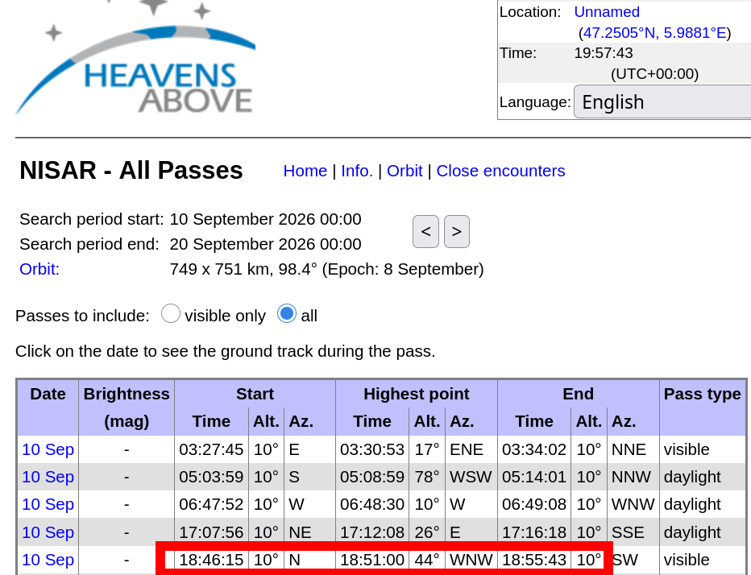
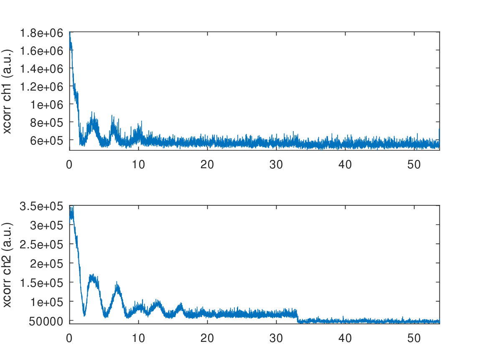
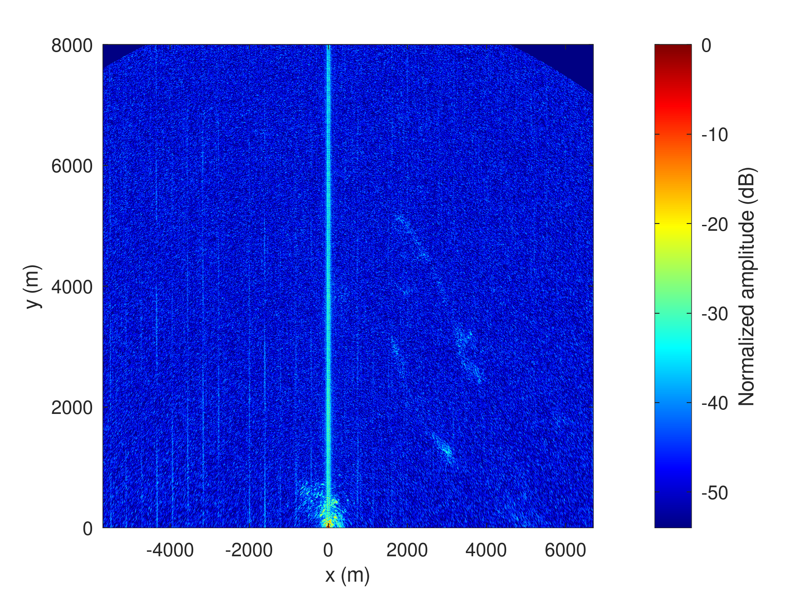
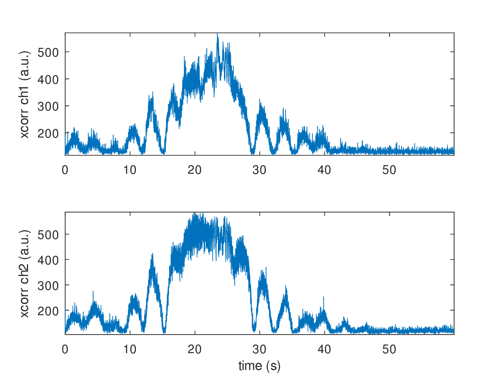
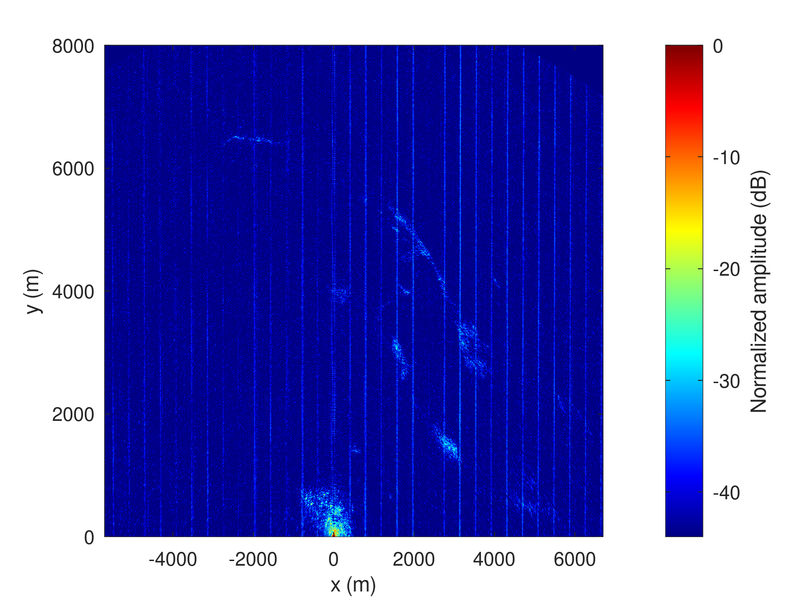

# MAX2771 reception

My computer decided that the USB3 port would only be detected as USB2: I had to reboot
and by the time the system was running again, the B210 only grabbed the last second
of the pass, quite useless. The MAX2771 behaved well as the Raspberry Pi5 controlling
the PocketSDR had been running and prepared well in advance.

At least this measurement was an opportunity to rationalize processing script and
benefit from the ``octave/`` repository.



## B210 (failure)

```
$ time sudo nice -n -20 ./rx_multi_NISAR

Creating the usrp device with: num_recv_frames=1024...
[INFO] [UHD] linux; GNU C++ version 16.1.0; Boost_109000; UHD_4.9.0.1-1.4
[INFO] [B200] Loading firmware image: /usr/share/uhd/4.9.0/images/usrp_b200_fw.hex...
[INFO] [B200] Detected Device: B210
[INFO] [B200] Loading FPGA image: /usr/share/uhd/4.9.0/images/usrp_b210_fpga.bin...
[INFO] [B200] Operating over USB 3.
[INFO] [B200] Detecting internal GPSDO....
[INFO] [GPS] No GPSDO found
[INFO] [B200] Initialize CODEC control...
[INFO] [B200] Initialize Radio control...
[INFO] [B200] Performing register loopback test...
[INFO] [B200] Register loopback test passed
[INFO] [B200] Performing register loopback test...
[INFO] [B200] Register loopback test passed
[INFO] [B200] Setting master clock rate selection to 'automatic'.
[INFO] [B200] Asking for clock rate 16.000000 MHz...
[INFO] [B200] Actually got clock rate 16.000000 MHz.
Using Device: Single USRP:
  Device: B-Series Device
  Mboard 0: B210
  RX Channel: 0
    RX DSP: 0
    RX Dboard: A
    RX Subdev: FE-RX2
  RX Channel: 1
    RX DSP: 1
    RX Dboard: A
    RX Subdev: FE-RX1
  TX Channel: 0
    TX DSP: 0
    TX Dboard: A
    TX Subdev: FE-TX2
  TX Channel: 1
    TX DSP: 1
    TX Dboard: A
    TX Subdev: FE-TX1

Setting RX Rate: 22.000000 Msps...
[INFO] [B200] Asking for clock rate 22.000000 MHz...
[INFO] [B200] Actually got clock rate 22.000000 MHz.
Actual RX Rate: 22.000000 Msps...

Setting RX Freq: 1229.000000 MHz...
Setting RX LO Offset: 0.000000 MHz...
Actual RX Freq: 1229.000000 MHz...

Setting RX1 Gain: 48.000000 dB...
Actual RX0 Gain: 70.000000 dB...
Actual RX1 Gain: 48.000000 dB...

Setting antennas TX/RX...

Setting device timestamp to 0...

Begin streaming 268435440 samples, 1.500000 seconds in the future...

Done!

$ stat /tmp/*bin
real    3m6.692s
user    0m0.015s
sys     0m0.013s

  File: /tmp/1.bin
  Size: 4724887552	Blocks: 9228296    IO Block: 4096   regular file
Device: 0,40	Inode: 79          Links: 1
Access: (0644/-rw-r--r--)  Uid: (    0/    root)   Gid: (    0/    root)
Access: 2026-09-10 20:51:01.713509328 +0200
Modify: 2026-09-10 20:53:54.028053971 +0200
Change: 2026-09-10 20:53:54.028053971 +0200
 Birth: 2026-09-10 20:51:01.713509328 +0200
  File: /tmp/2.bin
  Size: 4724875264	Blocks: 9228272    IO Block: 4096   regular file
Device: 0,40	Inode: 80          Links: 1
Access: (0644/-rw-r--r--)  Uid: (    0/    root)   Gid: (    0/    root)
Access: 2026-09-10 20:51:01.713509328 +0200
Modify: 2026-09-10 20:53:54.028053971 +0200
Change: 2026-09-10 20:53:54.028053971 +0200
 Birth: 2026-09-10 20:51:01.713509328 +0200
```


and truncate since only the first two seconds are more or less usable
```
octave> 2*22e6*2*2
ans = 176000000
```



## MAX2771



```
octave> 30*24e6
ans = 720000000
octave> 15*24e6
ans = 360000000
```

Truncate with
```
head -c 720000000 12.bin | tail -c 360000000 > 12zoom.bin
```


