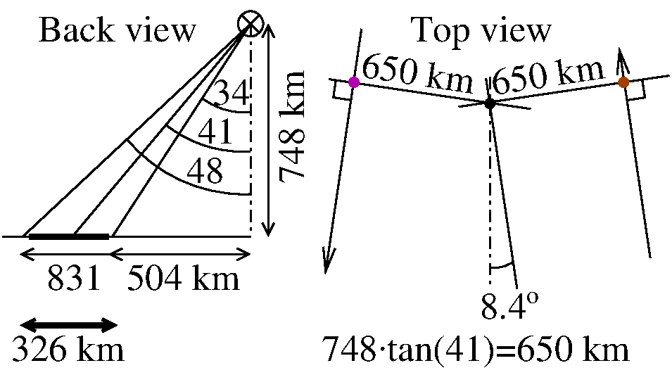

# Passive Bistatic RADAR using the spaceborne L and S-band NISAR satellite signal

A. Witze, *Arctic scientists iced out by radar mission*, Nature **566** (7 Feb. 2019): "Most other SAR missions are right-looking 
[... but...] NISAR science team decided to make its satellite left-looking for its entire primary mission."
confirmed by https://science.nasa.gov/mission/nisar/observation-strategy/: "As NISAR will be only left-looking -- a change in 
observation tactics since the early planning stages -- the mission will rely on data from the international constellation of 
SAR satellites to supplement its coverage around the Arctic pole" (last updated Jul 23, 2025)

## Need to know when to listen

From the TLE orbital parameters, the known satellite altitude and the known 
RADAR look angle (angle between antenna pointing and nadir) we can predict when
NISAR will be illuminating a given location. **Script update (Dec. 24, 2025): following
the failure to record a signal, I discovered that NISAR is left looking, not right-looking
like Sentinel-1. The S1 and NISAR script hence differ beyond altitude and orbital parameter
tuning.**



* ``go.sh``: main script, includes the location of the ground station. Requires GDAL to
convert from spherical (WGS84) to projected (UTM32N for France) and back.
* ``go.m``: GNU/Octave script for computing the projected RADAR beam on the ground
* ``nisar_tle.txt``: orbital parameters of the satellite, to be updated from Celestrak every
month or so
* ``predict_template.py``: <a href="https://rhodesmill.org/skyfield/">SkyField</a> 
based Python program to predict passes with highest 
elevations and hence listening time. Verified against <a href="https://www.heavens-above.com/">Heavens Above</a> for its excellent prediction
capability.

## Validation of the analysis with Sentinel1-A

The above scripts have been adapted to ESA's Sentinel1-A with ``go_s1a.m`` and ``go_s1a.sh`` and ``predict_s1a_template.py``
to use the orbital parameters and beam angle of this satellite. Futhermore, from <a href="https://browser.dataspace.copernicus.eu/?zoom=8&lat=47.4095&lng=6.08093">
the Copernicus browser</a> we search for Sentinel1-A images and identify for Besan&ccedil;on:

```
S1A_IW_SLC__1SDV_20251217T173206_20251217T173233_062358_07CF5C_1C1F.SAFE
S1A_IW_SLC__1SDV_20251216T054329_20251216T054356_062336_07CE83_0B06.SAFE
S1A_IW_SLC__1SDV_20251212T172400_20251212T172427_062285_07CC84_ED14.SAFE
S1A_IW_SLC__1SDV_20251209T055140_20251209T055207_062234_07CA8A_4D06.SAFE
S1A_IW_SLC__1SDV_20251205T173207_20251205T173234_062183_07C886_4F8A.SAFE
S1A_IW_SLC__1SDV_20251204T054330_20251204T054357_062161_07C7AC_6BCD.SAFE
```
whose filenames encode the date and the time of the illumination. From our analysis, we find

```
LEFT: 2025 Dec 29 17:32:11 culminate    <- left is afternoon pass
The Maximum elevation is 84deg 59' 52.4" 75deg 23' 15.3"
RIGHT: 2025 Dec 28 05:43:32 culminate   <- right is morning pass
The Maximum elevation is 82deg 32' 49.1" 285deg 13' 14.0"
```
matching nicely the two top passes after 12 days (20251217 between 17:32:06 and 17.32:33 matches 20251229 at 17:32:11 and 20251216 between 05:43:30 and 05:43:57 matches 20251228 at 05:43:32)

but
```
LEFT
2025 Dec 22 17:40:20 culminate
2025 Dec 27 06:41:19 culminate          <- remove left morning pass
 
RIGHT:
2025 Dec 23 05:35:25 culminate
2025 Dec 25 16:26:30 culminate          <- remove right evening pass
2025 Dec 30 16:34:36 culminate          <- remove right evening pass
```
leaves two unidentified predicted passes which do not occur (would have been
Dec. 10 and 11 according to the 12 day repeat). On the other hand, observations during
Dec. 9 and 12 leading to 21 and 24 are not predicted from the orbital parameters.

Looking at the trajectory in QGIs:

 

the green tracks match and the red ones do not (beaming in the wrong direction).

## Illumination prediction for NISAR

**Dec. 24, 2025: this analysis has been identified as erroneous since NISAR is left looking**

From this analysis, NISAR is expected to illuminate Paris on

```
2025 Dec 27 18:59:31 UTC
2025 Dec 28 04:36:35 UTC
```

with the Dec. 27 pass slightly off angle at 81 degrees instead of max. 83 degrees since 40+/-7 
translates to 90+/-7 >= 83 at azimuth. The beamwidth is $\lambda/D$ with $\lambda\simeq 300/1250=24$ cm at
L-band and $D=12$ m leading to a beamwidth (-3 dB) of 1.1 degrees.

The ground projected tracks as generated following:


All ground tracks were plotted using <a href="https://github.com/anoved/Ground-Track-Generator">Ground
Track Generator</a> with the command 
```
gtg --input nisar_tle.txt --output 251227 --start "2025-12-27 18:59:00.0 UTC" --end "2025-12-27 19:05:00.0 UTC" --interval 5s
```
or to get all output parameters
```
gtg --input nisar_tle.txt --output 241527 --start "2025-12-27 18:59:00.0 UTC" --end "2025-12-24 19:05:00.0 UTC" --interval 5s --attributes all --observer 48.87337 2.24588
```

We can convince that the Dec. 27, 2025 at 18h49 UTC pass is decending by extending the simulation duration and
seeing NISAR fly southward.

## Frequency settings

NISAR <a href="https://www.eoportal.org/ftp/satellite-missions/n/NISAR-25032021/NISAR.html">broadcasts</a>
at 1257.5+/-20 MHz and 3200+/-37.5 MHz. The L-band is within the reach of the lower L2/L5 band of the 
MAX2771 (1160-1290 MHz). **Error: P.A. Rosen & al, The NASA-ISRO SAR Mission -- A summary, IEEE Geoscience and
Remote Sensing Mag. (June 2025) shows in Fig. 16 that all frequency plans *start* at the same frequency, namely
1221.5 MHz, but are not centered on the same frequency.**
