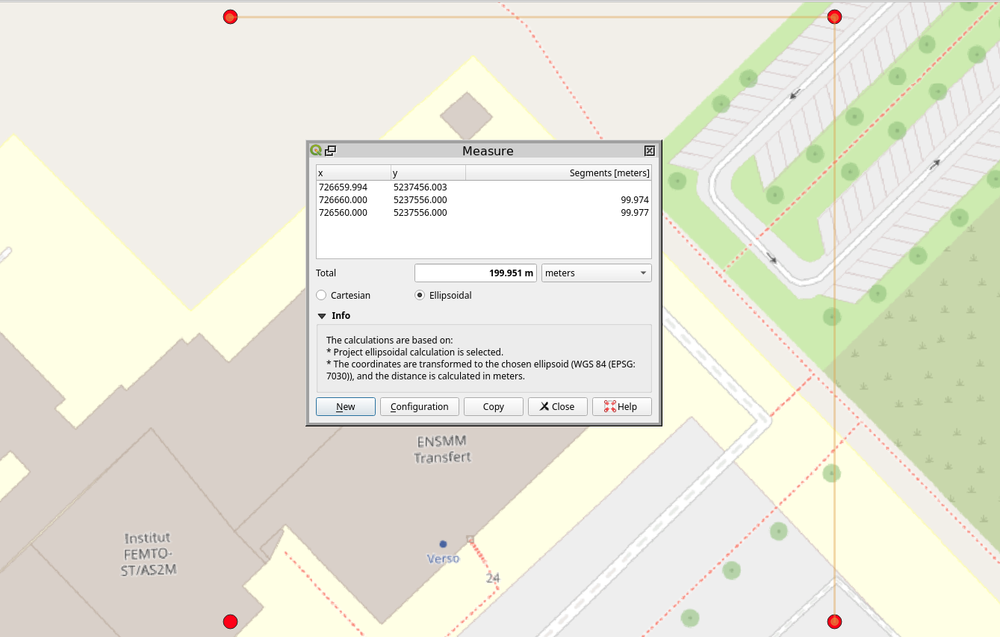
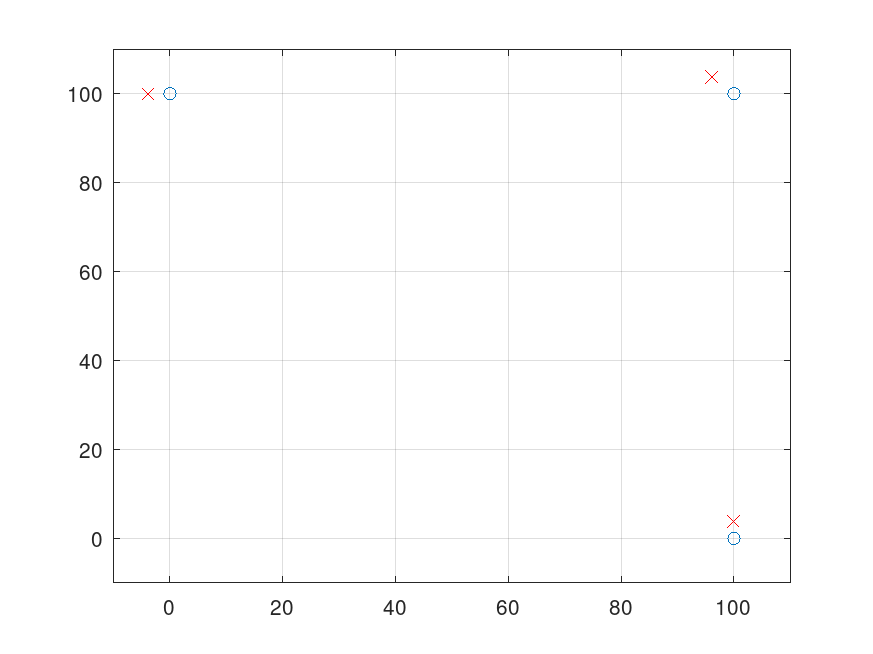

The receiver location in WGS84/UTM31N is 726236 E, 5236937 N.

According to https://rhodesmill.org/skyfield/api-topos.html, ``skyfield`` provides
coordinates in ITRS framework, which generate XYZ coordinates dependent on time.
Indeed for a fixed receiver position, computing at different times:
```
print(LocationC.at(ti).position.m)        # position of receiver
[-813086.63833934 4258558.65490422 4662383.50505473]
print(LocationC.at(ti+1/24).position.m)   # position of receiver 1h later
[-1889918.57901051  3898566.01092667  4665151.92357872]
```

meaning the ITRS is a fixed framework in space, not rotating with the Earth.

In ``predict_verification.py``, we select 4 points, one at the receiver location
and another 3 offset by 100 m in X, in Y and in both XY, in WGS84/UTM31N.



These coordinates are exported using QGIS to WGS84 (EPSG:4326) and used in the
skyfield validation program.
```
LocationC= wgs84.latlon(47.2514446234477,5.99423112464455)  # Receiver (Besancon, France)
LocationA= wgs84.latlon(47.2514100993763,5.99555087627152)   
LocationB= wgs84.latlon(47.2523432298483,5.99428181905344)   
LocationD= wgs84.latlon(47.2523087046979,5.99560159294324)
diffAC=LocationA-LocationC
diffBC=LocationB-LocationC
diffDC=LocationD-LocationC
```
The output is now converted to a coordinate system relative to LocationC, which
is *not* the same as converting the position difference to ITRS:
```
print(ti.utc_strftime('%Y %b %d %H:%M:%S'))
print(diffAC.at(ti).frame_xyz(LocationC).m)
print(diffAC.at(ti+1/24).frame_xyz(LocationC).m)
print(diffAC.at(ti+1/24).frame_xyz(itrs).m)
print(diffBC.at(ti).frame_xyz(LocationC).m)
print(diffBC.at(ti+1/24).frame_xyz(LocationC).m)
print(diffBC.at(ti+1/24).frame_xyz(itrs).m)
print(diffDC.at(ti).frame_xyz(LocationC).m)
print(diffDC.at(ti+1/24).frame_xyz(LocationC).m)
print(diffDC.at(ti+1/24).frame_xyz(itrs).m)
```
The result is
```
[-3.83739442e+00  9.99032182e+01 -7.82153648e-04]
[-3.83739442e+00  9.99032182e+01 -7.82153362e-04]
[-7.6307107  99.65120733 -2.60532951]
[ 9.99032450e+01  3.83742330e+00 -7.84574849e-04]
[ 9.99032450e+01  3.83742330e+00 -7.84575498e-04]
[-73.36305875  -3.84477996  67.81197132]
[ 9.60657949e+01  1.03740639e+02 -1.56654115e-03]
[ 9.60657949e+01  1.03740639e+02 -1.56654127e-03]
[-80.99372847  95.80642953  65.20660418]
```
so -3.8 m and 100 m in XY (all Z are 0) irrelevant of the time of the
simulation, differring from ITRS by another 3.8 m. 

Hence, the carthesian position of the satellite with respect to the
ground receiver is best computed using this approach which provides a
result independent of time and (mostly) consistent with UTM projected 
coordinates.
```
sqrt(sum([-3.83739442e+00 9.99032182e+01 -7.82153648e-04].^2))=99.977
sqrt(sum([9.99032450e+01  3.83742330e+00 -7.84574849e-04].^2))=99.977
sqrt(sum([9.60657949e+01  1.03740639e+02 -1.56654115e-03].^2))/sqrt(2)=99.977
```

Despite the distance being (mostly) correct, we observe a rotation of the
output framework (red) with respect to the input framework (blue):


