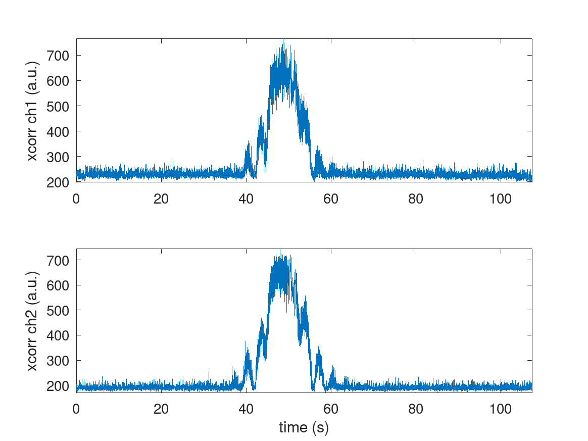
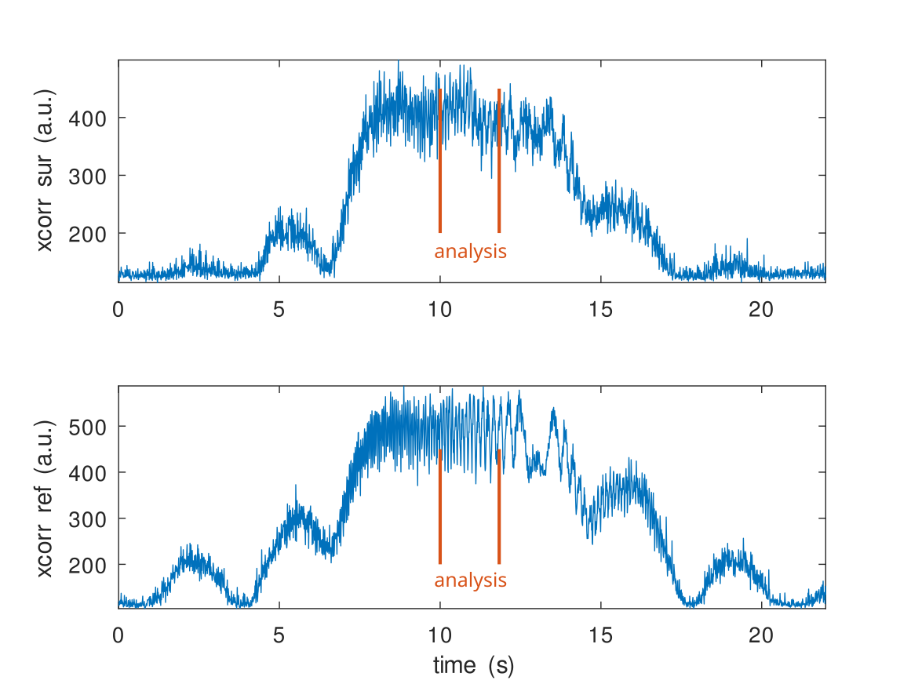
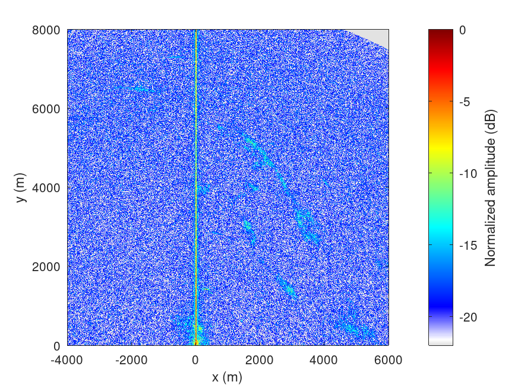

## Compact acquisition result (``pocket_dump -r``) with 30 dB attenuator on the reference channel

# Packed dataset processing

The packed dataset was generated with the ``-r`` (raw) option of ``pocket_dump``

1. ``b210process_packed.m`` to assess the acquisition quality and identify when the
beam illuminated the receivers
2. ``go_packed.m`` to identify the chirp time of reception: save ``kpos`` in ``kpos.mat``
3. ``nisar_process5.m`` for range-azimuth compression

The cross-correlation between the reference channel and the synthetic chirp allows for
coarse and fine time of reception identification:

Range-azimuth compression:

Overlay on a geographical context:

# Packed to unpacked: tests in C

In order to assess the efficiency of bitwise operations in GNU/Octave, a C implementation
of the packed to unpacked IQ values is proposed. There is hardly any benefit, since the
vector operation in GNU/Octave calls the <a href="https://docs.octave.org/doxygen/11/d1/de8/bitfcns_8cc_source.html">C++ library</a> 
implementation. Nevertheless, the
unpacked version of the processing scripts is also provided for reference:
1. ``make`` to compile ``packed2unpacked``
2. ``b210process_unpacked`` to validate the I0+jQ0 and I1+jQ1.
2. ``go_unpacked`` to generate ``kpos`` stored in ``kpos.mat``
