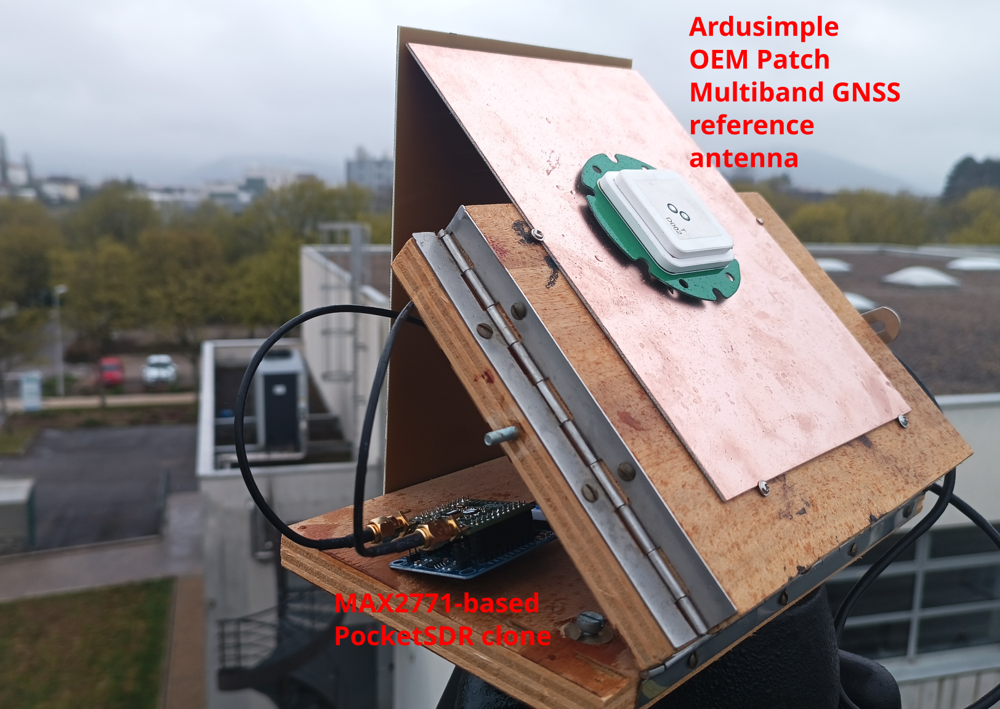
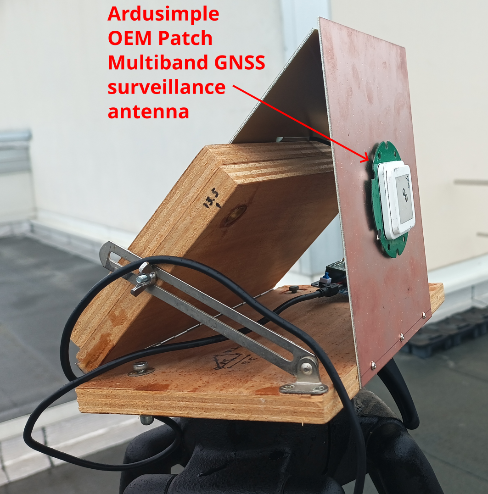
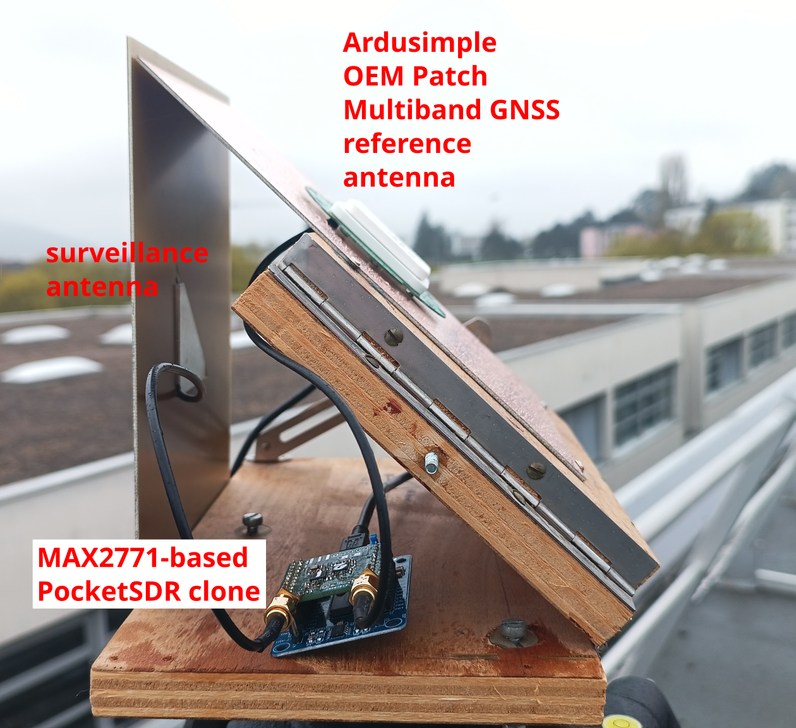
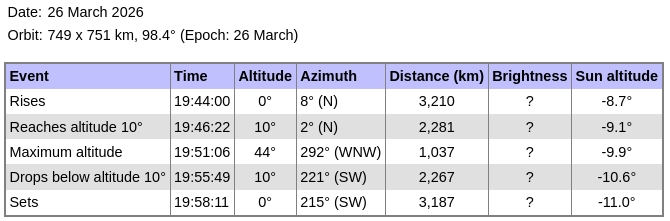
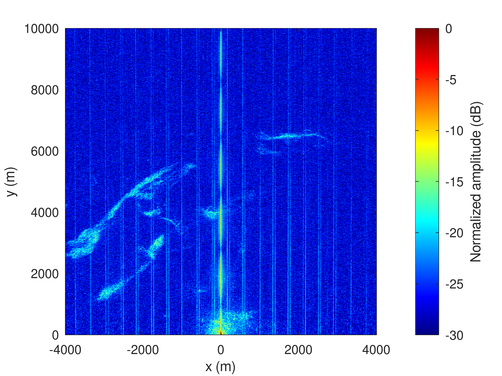
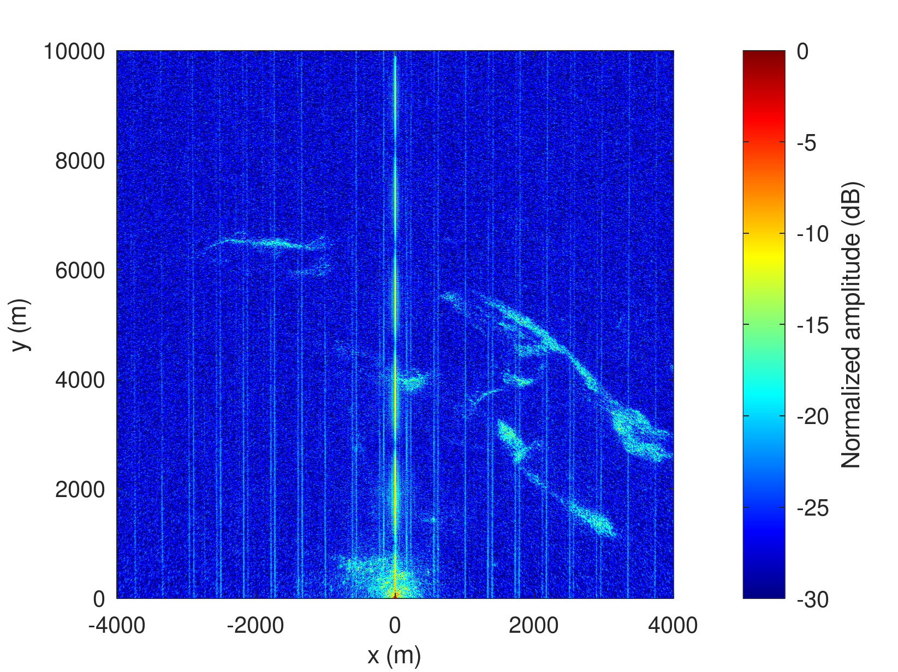
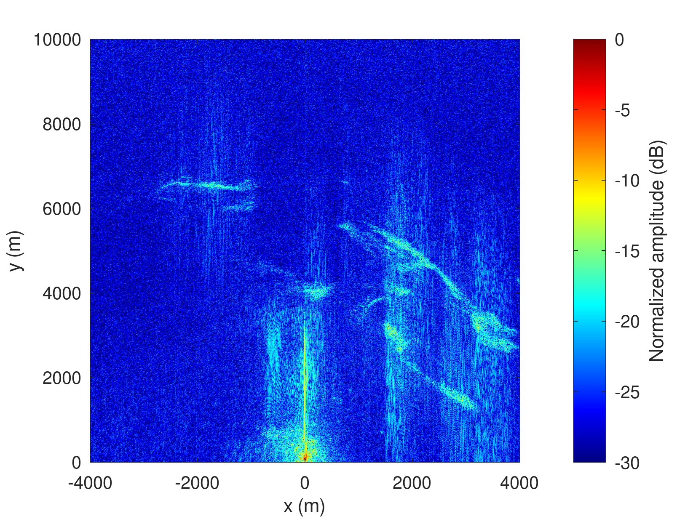

# NISAR reception from PocketSDR clone with two MAX2771

Experimental setup: two Ardusimple Multiband GNSS antennas are fitted
to the MAX2771-based PocketSDR clone. One antenna is facing the sky
at an angle of about 45 degrees in the direction NISAR is beaming from
(East or West depending on ascending or descending pass) while the second
antenna is vertically mounted and facing in the opposite direction. The
ground plane of the reference antenna shields the surveillance antenna from
the direct signal.



Configuring the PocketSDR to record a 24 MHz bandwidth around 1229 MHz:
```
sudo PocketSDR/app/pocket_conf/pocket_conf ./pocket_NISAR_24MHz.conf 
sudo PocketSDR/app/pocket_conf/pocket_conf 
#  [CH1] F_LO =  1229.025000 MHz, F_ADC = 24.000000 MHz (IQ), F_FILT =  0.0 MHz, BW_FILT = 23.4 MHz
#  [CH2] F_LO =  1229.025000 MHz, F_ADC =  0.000000 MHz (IQ), F_FILT =  0.0 MHz, BW_FILT = 23.4 MHz
```

```
sudo PocketSDR/app/pocket_dump/pocket_dump /tmp/1.bin /tmp/2.bin
```
The recording only started a few seconds before the predicted maximum elevation 



```
$ stat /tmp/1.bin
  File: /tmp/1.bin
  Size: 2142240768      Blocks: 4184064    IO Block: 4096   regular file
Device: 0,39    Inode: 180679      Links: 1
Access: (0644/-rw-r--r--)  Uid: (    0/    root)   Gid: (    0/    root)
Access: 2026-03-26 20:03:05.885563149 +0100
Modify: 2026-03-26 19:51:43.824067742 +0100
Change: 2026-03-26 19:51:43.824067742 +0100
 Birth: 2026-03-26 19:50:59.190699895 +0100
$ stat /tmp/2.bin
  File: /tmp/2.bin
  Size: 2142240768      Blocks: 4184064    IO Block: 4096   regular file
Device: 0,39    Inode: 180680      Links: 1
Access: (0644/-rw-r--r--)  Uid: (    0/    root)   Gid: (    0/    root)
Access: 2026-03-26 19:50:59.190699895 +0100
Modify: 2026-03-26 19:51:43.824067742 +0100
Change: 2026-03-26 19:51:43.824067742 +0100
 Birth: 2026-03-26 19:50:59.190699895 +0100
```

but still allowed to collect useful data on the surveillance and 
reference channels.

Because the MAX2771 provides the complex conjugate of the IQ stream (i.e. I-jQ)
the original image was upside down when interpreting the file record content
as I+jQ



and flipped after correcting for I-jQ



Projecting on the map+DEM validates the source of the reflections


Since the MAX2771 samples with low resolution ADCs, attempts were made
to replace the reference channel with synthetic chirps, requiring to match
the time delay and phase of the observed signal:


